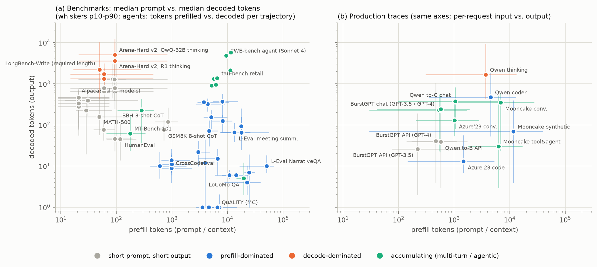

# LLM inference workloads for evaluating KV-cache eviction policies

A research study of **which kinds of workloads an LLM KV-cache eviction policy must be tested on**. It covers:

- how academia and industry categorize LLM tasks;
- a taxonomy organized around what actually stresses a KV cache;
- measurements of workload characteristics on real benchmark data, agent trajectories and production traces;
- a catalog of 284 benchmark tasks, each mapped onto the taxonomy, plus a tool that maps *any* suite and
  recommends tasks that close its coverage gaps.

"Eviction" is taken in both senses:

- **primarily**, token-level KV eviction within a request (StreamingLLM, H2O, SnapKV, …);
- **secondarily**, cross-request prefix-cache eviction (LRU / LFU / TTL in vLLM, SGLang, Mooncake).

## The taxonomy in one table

Tasks are described on two layers:

- **Capability domain** (math, code, knowledge, …): keeps a test suite realistic.
- **KV-stress signature**: eight facets that decide how an eviction policy can hurt a task.
  - growth: where the KV comes from
  - dependency: which earlier tokens must stay readable
  - query timing: is the question known when the cache is compressed?
  - fidelity: how exactly information must be reproduced
  - composition
  - redundancy
  - evidence position
  - cross-request reuse

The signature partitions workloads into **12 archetypes**:

| archetype | signature | what eviction breaks | canonical tasks |
|---|---|---|---|
| compact | whole sequence < 2K tokens, parametric | little: a control | MMLU, ARC, HellaSwag |
| short_gen | compact, self-referential, CoT / code / chat | copied numbers and identifiers under ratio budgets | GSM8K, HumanEval, IFEval, AlpacaEval |
| long_reason | decode-dominated, far-back self-reference | intermediate results; output length inflates | AIME / MATH-500 / GPQA with thinking models |
| long_gen | decode-dominated, persistent constraints | coherence, length / outline adherence | LongBench-Write, LongGenBench |
| sparse_retrieval | prefill-dominated, one evidence span | the span, especially if the query is hidden or the span is a long UUID | NIAH, RULER NIAH, NarrativeQA |
| multi_hop | several / chained evidence spans | hops the question does not name | RULER VT, HotpotQA, BABILong |
| aggregation | information spread over the whole context | flat attention (counting); redundant summaries degrade gracefully | GovReport, RULER CWE / FWE, Math.Find |
| many_shot_icl | many homogeneous demonstrations | effective shot count, label definitions | TREC, BANKING77 many-shot |
| lc_code_struct | exact far-away identifiers in regular text | identifiers / signatures | RepoBench-P, CrossCodeEval, JSON |
| shared_context_multiturn | several queries against one retained context | whatever the *next* question needs | SCBench, LoCoMo, LongMemEval |
| agentic | accumulating context, tool observations, persistent policy / tool schemas | instructions, far-back IDs / paths | SWE-bench, τ-bench, BFCL multi-turn |
| streaming_lm | recency-dominated continuation | little: lenient sanity check | PG19 perplexity |

For cross-request eviction there are also six **stream archetypes**: independent, shared-prefix fan-in, session
continuation, agentic loop, reasoning-heavy, and fan-out.

Full definitions, operational tests and a decision flowchart are in [docs/taxonomy.md](docs/taxonomy.md). The
machine-readable version is [taxonomy/taxonomy.yaml](taxonomy/taxonomy.yaml).

## Key findings

1. **Capability categories do not predict KV behavior.** "Math" ranges widely:

   | math task | prompt (tokens) | output (tokens) | measured behavior |
   |---|---|---|---|
   | GSM8K CoT | 712 | 76 | every dependency within ~100 tokens |
   | Thinking-model reasoning | ~90 | 3.6–5.1K | 42–46% of verbatim dependencies > 512 tokens back |
   | InfiniteBench Math.Find | ~88K | 1 | flat, global attention |

   "Code" ranges from HumanEval (117 → 46 tokens) to SWE-bench agents: 12–47 LLM calls, peak context 13–17K
   (p50), 53–71% tool observations.
2. **A sliding window's miss ratio differs by two orders of magnitude across workloads.** Model-free dependency
   distances show this ([Fig. 2](figures/fig2_reuse_distance.png)). The share of copy dependencies beyond 512
   tokens is:
   - 0–3% for short CoT, code and chat;
   - 42–46% for thinking traces;
   - 50–62% for coding agents;
   - 71–96% for long-document QA, summarization and conversational memory.
3. **Questions about the same document need different parts of it.** One question needs 1–12% of a document's
   chunks. The union over the 3–9 questions asked of the same document needs 2–47%, and pairwise overlap is
   Jaccard 0.01–0.17. Compressing for one query discards the next query's evidence, yet 83% of long-context
   benchmark tasks put a single question after the context.
4. **Haystack redundancy spans two orders of magnitude.**
   - repeated passkey filler: 206
   - natural essays: 2.6
   - random-UUID JSON: 1.8

   Results on repetitive haystacks overstate eviction quality.
5. **Agents keep a large persistent prefix.** τ-bench's policy plus tool schemas is 52–61% of the context and must
   be obeyed at every step. Cross-step prefix reuse saves 9–44× prefill on SWE-bench. Production agentic coding
   runs at a median 110–132K input tokens per call.
6. **Production reuse depends on the service.**
   - To-B API traffic reuses shared templates only: 0% same-session. LFU beats LRU (0.41 vs 0.29 at a 64K-token
     cache).
   - To-C chat reuse is 72% same-session, after minutes of think time. LRU reaches 0.30 where OPT reaches 0.52
     (1M tokens).
   - Thinking requests decode 43% of all tokens, but that reasoning is rarely reused.
7. **The eviction literature has tested the wrong regimes.** We mapped the benchmarks of 67 eviction/compression
   methods onto the archetypes ([Fig. 7](figures/fig7_literature_coverage.png)).
   - 2023–24 methods: sparse retrieval and aggregation 77% each; long reasoning 0%; agents 0%; multi-turn 10%.
   - 2025–26 methods: long reasoning 54%, multi-turn 21%, agents 7% (2026 preprints only), long generation 7%.
   - No existing suite exceeds 59% weighted coverage of the taxonomy. The LongBench + NIAH standard reaches 41%.
8. **A 25-task core suite covers 100%; a 14-task lite suite covers 91%.** Both are built from public benchmarks,
   with an evaluation protocol for eviction studies ([docs/recommendations.md](docs/recommendations.md)).



## Documents

| document | contents |
|---|---|
| [docs/taxonomy.md](docs/taxonomy.md) | the taxonomy: domains, 8 facets, 12 + 6 archetypes, classification flowchart, crosswalk to RULER / HELMET / SCBench / LooGLE / Goldman et al. |
| [docs/characterization.md](docs/characterization.md) | measurements M1–M6 with 21 numbered observations |
| [docs/literature.md](docs/literature.md) | how the field categorizes workloads; what 76 KV-eviction methods and studies evaluate on; evaluation findings; industry usage and traces |
| [docs/benchmark_mapping.md](docs/benchmark_mapping.md) | coverage matrix of 33 suites, their gaps, and the full 284-task catalog |
| [docs/recommendations.md](docs/recommendations.md) | core / lite / stream test suites, policy-family risk map, 12-point evaluation protocol, next-step validation study |
| [docs/methodology.md](docs/methodology.md) | reproduction, data provenance, definitions, threats to validity |
| [docs/tables.md](docs/tables.md) | all measurement tables (auto-generated) |
| [docs/references.md](docs/references.md), [docs/notes/](docs/notes) | bibliography, and per-fact evidence notes with source URLs and confidence tags |

## Mapping your own benchmark suite

```bash
pip install pyyaml
python tools/coverage.py --list-suites
python tools/coverage.py --suite "RULER" --recommend 6            # archetype/facet coverage, gaps, tasks that close them
python tools/coverage.py --tasks longbench:,scbench:retr-kv,aime  # any mix of catalog task ids or suite prefixes
python tools/coverage.py --custom my_benchmark.yaml               # benchmarks not in the catalog, described by facets
```

To add a benchmark permanently, add rules or overrides to `taxonomy/build_catalog.py` and rebuild.

## Repository layout

```
taxonomy/   taxonomy.yaml (facets, archetypes), benchmarks.yaml (284 tasks, 33 suites; generated),
            build_catalog.py (mapping rules), sources/ (task- and method-level tables with provenance)
tools/      coverage.py (suite mapping, gaps, greedy recommendations), render_catalog.py
analysis/   fetch_data.sh, build_tokenizers.py, length_profiles.py, reuse_distance.py, context_scope.py,
            agent_trajectories.py, serving_traces.py, literature_coverage.py, make_figures.py, render_tables.py
results/    all measurement outputs (CSV / JSON)
figures/    fig1–fig7
docs/       report chapters, evidence notes, references
```

Everything is reproducible from public data (GitHub and a public S3 bucket) with the steps in
[docs/methodology.md](docs/methodology.md). Raw data is not committed.
