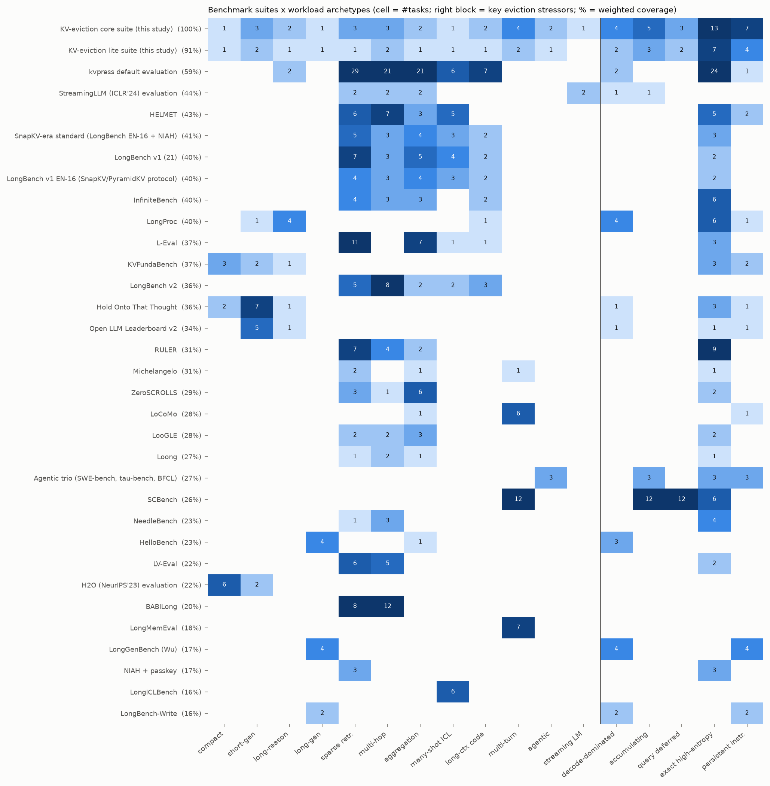

# Mapping benchmark suites onto the taxonomy

*Generated by `tools/render_catalog.py` from [`taxonomy/benchmarks.yaml`](../taxonomy/benchmarks.yaml) (284 tasks) — do not edit by hand.*

## How to map a suite

```bash
python tools/coverage.py --list-suites
python tools/coverage.py --suite "RULER" --recommend 6      # coverage report + tasks that close the gaps
python tools/coverage.py --tasks ruler:,scbench:retr-kv,aime   # any mix of task ids / suite prefixes
python tools/coverage.py --custom my_benchmark.yaml            # a benchmark not in the catalog (facet values)
python tools/coverage.py --suite "L-Eval" --alt              # count shared-context (multi-query) protocols
```

The **coverage score** weights requirements as follows:

- each of the 12 archetypes: 3;
- each growth / dependency / query value: 2;
- each fidelity value and each stream-level reuse type: 1;
- each composition value and each evidence position: 0.5.

A suite scores 100% when it exercises every archetype and every facet value that matters for eviction.



## Coverage matrix (tasks per archetype; key stressors)

Column codes:

- CMP = compact; SGEN = short-gen; LRSN = long-reason; LGEN = long-gen;
- RETR = sparse retrieval; MHOP = multi-hop; AGG = aggregation; ICL = many-shot ICL;
- CODE = long-context code & structured; MTURN = shared-context multi-turn; AGENT = agentic;
  STRM = streaming LM.

Stressor columns count tasks with decode-dominated growth, accumulating growth, deferred queries,
exact high-entropy fidelity and persistent-constraint dependency.

| suite | n | score | CMP | SGEN | LRSN | LGEN | RETR | MHOP | AGG | ICL | CODE | MTURN | AGENT | STRM | decode-dom. | accum. | q-deferred | exact-HE | persistent |
|---|---|---|---|---|---|---|---|---|---|---|---|---|---|---|---|---|---|---|---|
| KV-eviction core suite (this study) | 25 | 100% | 1 | 3 | 2 | 1 | 3 | 3 | 2 | 1 | 2 | 4 | 2 | 1 | 4 | 5 | 3 | 13 | 7 |
| KV-eviction lite suite (this study) | 14 | 91% | 1 | 2 | 1 | 1 | 1 | 2 | 1 | 1 | 1 | 2 | 1 | · | 2 | 3 | 2 | 7 | 4 |
| kvpress default evaluation | 86 | 59% | · | · | 2 | · | 29 | 21 | 21 | 6 | 7 | · | · | · | 2 | · | · | 24 | 1 |
| StreamingLLM (ICLR'24) evaluation | 8 | 44% | · | · | · | · | 2 | 2 | 2 | · | · | · | · | 2 | 1 | 1 | · | · | · |
| HELMET | 21 | 43% | · | · | · | · | 6 | 7 | 3 | 5 | · | · | · | · | · | · | · | 5 | 2 |
| SnapKV-era standard (LongBench EN-16 + NIAH) | 17 | 41% | · | · | · | · | 5 | 3 | 4 | 3 | 2 | · | · | · | · | · | · | 3 | · |
| LongBench v1 (21) | 21 | 40% | · | · | · | · | 7 | 3 | 5 | 4 | 2 | · | · | · | · | · | · | 2 | · |
| LongBench v1 EN-16 (SnapKV/PyramidKV protocol) | 16 | 40% | · | · | · | · | 4 | 3 | 4 | 3 | 2 | · | · | · | · | · | · | 2 | · |
| InfiniteBench | 12 | 40% | · | · | · | · | 4 | 3 | 3 | · | 2 | · | · | · | · | · | · | 6 | · |
| LongProc | 6 | 40% | · | 1 | 4 | · | · | · | · | · | 1 | · | · | · | 4 | · | · | 6 | 1 |
| L-Eval | 20 | 37% | · | · | · | · | 11 | · | 7 | 1 | 1 | · | · | · | · | · | · | 3 | · |
| KVFundaBench | 6 | 37% | 3 | 2 | 1 | · | · | · | · | · | · | · | · | · | · | · | · | 3 | 2 |
| LongBench v2 | 20 | 36% | · | · | · | · | 5 | 8 | 2 | 2 | 3 | · | · | · | · | · | · | · | · |
| Hold Onto That Thought | 10 | 36% | 2 | 7 | 1 | · | · | · | · | · | · | · | · | · | 1 | · | · | 3 | 1 |
| Open LLM Leaderboard v2 | 6 | 34% | · | 5 | 1 | · | · | · | · | · | · | · | · | · | 1 | · | · | 1 | 1 |
| RULER | 13 | 31% | · | · | · | · | 7 | 4 | 2 | · | · | · | · | · | · | · | · | 9 | · |
| Michelangelo | 3 | 31% | · | · | · | · | 2 | · | 1 | · | · | 1 | · | · | · | · | · | 1 | · |
| ZeroSCROLLS | 10 | 29% | · | · | · | · | 3 | 1 | 6 | · | · | · | · | · | · | · | · | 2 | · |
| LoCoMo | 7 | 28% | · | · | · | · | · | · | 1 | · | · | 6 | · | · | · | · | · | · | 1 |
| LooGLE | 7 | 28% | · | · | · | · | 2 | 2 | 3 | · | · | · | · | · | · | · | · | 2 | · |
| Loong | 4 | 27% | · | · | · | · | 1 | 2 | 1 | · | · | · | · | · | · | · | · | 1 | · |
| Agentic trio (SWE-bench, tau-bench, BFCL) | 3 | 27% | · | · | · | · | · | · | · | · | · | · | 3 | · | · | 3 | · | 3 | 3 |
| SCBench | 12 | 26% | · | · | · | · | · | · | · | · | · | 12 | · | · | · | 12 | 12 | 6 | · |
| NeedleBench | 4 | 23% | · | · | · | · | 1 | 3 | · | · | · | · | · | · | · | · | · | 4 | · |
| HelloBench | 5 | 23% | · | · | · | 4 | · | · | 1 | · | · | · | · | · | 3 | · | · | · | · |
| LV-Eval | 11 | 22% | · | · | · | · | 6 | 5 | · | · | · | · | · | · | · | · | · | 2 | · |
| H2O (NeurIPS'23) evaluation | 8 | 22% | 6 | 2 | · | · | · | · | · | · | · | · | · | · | · | · | · | · | · |
| BABILong | 20 | 20% | · | · | · | · | 8 | 12 | · | · | · | · | · | · | · | · | · | · | · |
| LongMemEval | 7 | 18% | · | · | · | · | · | · | · | · | · | 7 | · | · | · | · | · | · | · |
| LongGenBench (Wu) | 4 | 17% | · | · | · | 4 | · | · | · | · | · | · | · | · | 4 | · | · | · | 4 |
| NIAH + passkey | 3 | 17% | · | · | · | · | 3 | · | · | · | · | · | · | · | · | · | · | 3 | · |
| LongICLBench | 6 | 16% | · | · | · | · | · | · | · | 6 | · | · | · | · | · | · | · | · | · |
| LongBench-Write | 2 | 16% | · | · | · | 2 | · | · | · | · | · | · | · | · | 2 | · | · | · | 2 |

## Gaps of widely used suites

| suite | missing archetypes | missing query / growth / dependency values |
|---|---|---|
| LongBench v1 (21) (40%) | CMP, SGEN, LRSN, LGEN, MTURN, AGENT, STRM | growth=compact, growth=decode_dominated, growth=mixed_long, growth=accumulating, dependency=parametric, dependency=self, dependency=persistent, query=known_first, query=deferred, query=evolving |
| LongBench v2 (36%) | CMP, SGEN, LRSN, LGEN, MTURN, AGENT, STRM | growth=compact, growth=decode_dominated, growth=mixed_long, growth=accumulating, dependency=parametric, dependency=local, dependency=self, dependency=persistent, query=known_first, query=deferred, query=evolving |
| RULER (31%) | CMP, SGEN, LRSN, LGEN, ICL, CODE, MTURN, AGENT, STRM | growth=compact, growth=decode_dominated, growth=mixed_long, growth=accumulating, dependency=parametric, dependency=local, dependency=self, dependency=persistent, query=known_first, query=deferred, query=evolving |
| InfiniteBench (40%) | CMP, SGEN, LRSN, LGEN, ICL, MTURN, AGENT, STRM | growth=compact, growth=decode_dominated, growth=accumulating, dependency=parametric, dependency=local, dependency=persistent, query=known_first, query=deferred, query=evolving |
| HELMET (43%) | CMP, SGEN, LRSN, LGEN, CODE, MTURN, AGENT, STRM | growth=compact, growth=decode_dominated, growth=accumulating, dependency=parametric, dependency=local, dependency=self, query=deferred, query=evolving |
| SCBench (26%) | CMP, SGEN, LRSN, LGEN, RETR, MHOP, AGG, ICL, CODE, AGENT, STRM | growth=compact, growth=prefill_dominated, growth=decode_dominated, growth=mixed_long, dependency=parametric, dependency=local, dependency=self, dependency=persistent, query=known_last, query=known_first, query=evolving |
| L-Eval (37%) | CMP, SGEN, LRSN, LGEN, MHOP, MTURN, AGENT, STRM | growth=compact, growth=decode_dominated, growth=mixed_long, growth=accumulating, dependency=parametric, dependency=local, dependency=persistent, query=known_first, query=deferred, query=evolving |
| BABILong (20%) | CMP, SGEN, LRSN, LGEN, AGG, ICL, CODE, MTURN, AGENT, STRM | growth=compact, growth=decode_dominated, growth=mixed_long, growth=accumulating, dependency=parametric, dependency=local, dependency=global, dependency=self, dependency=persistent, query=known_first, query=deferred, query=evolving |
| LoCoMo (28%) | CMP, SGEN, LRSN, LGEN, RETR, MHOP, ICL, CODE, AGENT, STRM | growth=compact, growth=decode_dominated, growth=mixed_long, growth=accumulating, dependency=local, dependency=self, query=known_first, query=deferred, query=evolving |
| LongMemEval (18%) | CMP, SGEN, LRSN, LGEN, RETR, MHOP, AGG, ICL, CODE, AGENT, STRM | growth=compact, growth=decode_dominated, growth=mixed_long, growth=accumulating, dependency=parametric, dependency=local, dependency=self, dependency=persistent, query=known_first, query=deferred, query=evolving |
| SnapKV-era standard (LongBench EN-16 + NIAH) (41%) | CMP, SGEN, LRSN, LGEN, MTURN, AGENT, STRM | growth=compact, growth=decode_dominated, growth=mixed_long, growth=accumulating, dependency=parametric, dependency=self, dependency=persistent, query=known_first, query=deferred, query=evolving |
| kvpress default evaluation (59%) | CMP, SGEN, LGEN, MTURN, AGENT, STRM | growth=compact, growth=accumulating, dependency=parametric, query=known_first, query=deferred |
| Open LLM Leaderboard v2 (34%) | CMP, LGEN, RETR, MHOP, AGG, ICL, CODE, MTURN, AGENT, STRM | growth=prefill_dominated, growth=mixed_long, growth=accumulating, dependency=local, dependency=global, query=known_last, query=known_first, query=deferred |
| KVFundaBench (37%) | LGEN, RETR, MHOP, AGG, ICL, CODE, MTURN, AGENT, STRM | growth=prefill_dominated, growth=decode_dominated, growth=accumulating, dependency=local, dependency=multi, dependency=global, query=known_first, query=deferred |
| Hold Onto That Thought (36%) | LGEN, RETR, MHOP, AGG, ICL, CODE, MTURN, AGENT, STRM | growth=prefill_dominated, growth=mixed_long, growth=accumulating, dependency=local, dependency=multi, dependency=global, query=known_first, query=deferred |
| H2O (NeurIPS'23) evaluation (21%) | LRSN, LGEN, RETR, MHOP, AGG, ICL, CODE, MTURN, AGENT, STRM | growth=prefill_dominated, growth=decode_dominated, growth=mixed_long, growth=accumulating, dependency=local, dependency=point, dependency=multi, dependency=self, dependency=persistent, query=known_first, query=deferred, query=evolving |
| StreamingLLM (ICLR'24) evaluation (44%) | CMP, SGEN, LRSN, LGEN, ICL, CODE, MTURN, AGENT | growth=compact, growth=mixed_long, dependency=parametric, dependency=self, dependency=persistent, query=known_first, query=deferred |

## Full catalog

Two kinds of evidence sit behind each row:

- Facet values are assigned by the rules in `taxonomy/build_catalog.py`.
- Lengths and metrics come from official repositories. The `conf` column is the confidence of those
  source facts.

A task marked † can additionally be run in shared-context mode (compress once, ask all its
questions), which exercises `query=deferred`.

### LongBench (v1)

| id | archetype | growth | dependency | query | fidelity | input | output | conf |
|---|---|---|---|---|---|---|---|---|
| `longbench:narrativeqa` | RETR | prefill_dominated | point | known_last | semantic | avg 18,409 words | short phrase (gen cap 128 tokens) | verified |
| `longbench:qasper` | RETR | prefill_dominated | point | known_last | semantic | avg 3,619 words | short phrase/sentence, yes/no or 'unanswerable' (c | verified |
| `longbench:multifieldqa-en` | RETR | prefill_dominated | point | known_last | semantic | avg 4,559 words | short answer (cap 64) | verified |
| `longbench:multifieldqa-zh` | RETR | prefill_dominated | point | known_last | semantic | avg 6,701 characters | short answer (cap 64) | verified |
| `longbench:hotpotqa` | MHOP | prefill_dominated | multi, point | known_last | semantic | avg 9,151 words | short span (cap 32) | verified |
| `longbench:2wikimultihopqa` | MHOP | prefill_dominated | multi, point | known_last | semantic | avg 4,887 words | short span (cap 32) | verified |
| `longbench:musique` | MHOP | prefill_dominated | multi, point | known_last | semantic | avg 11,214 words | short span (cap 32) | verified |
| `longbench:dureader` | RETR | prefill_dominated | point, multi | known_last | semantic | avg 15,768 characters | free-form Chinese answer (cap 128) | verified |
| `longbench:govreport` | AGG | prefill_dominated | global | known_last | semantic | avg 8,734 words | one-page summary (cap 512 tokens) | verified |
| `longbench:qmsum` | AGG | prefill_dominated | global, point | known_last | semantic | avg 10,614 words | one or more sentences (cap 512) | verified |
| `longbench:multinews` | AGG | prefill_dominated | global | known_last | semantic | avg 2,113 words | one-page summary (cap 512) | verified |
| `longbench:vcsum` | AGG | prefill_dominated | global | known_last | semantic | avg 15,380 characters | paragraph summary (cap 512) | verified |
| `longbench:trec` | ICL | prefill_dominated | global, point | known_last | exact_low_entropy | avg 5,177 words | class label (cap 64) | verified |
| `longbench:triviaqa` | ICL | prefill_dominated | point, local | known_last | semantic | avg 8,209 words | short span (cap 32) | verified |
| `longbench:samsum` | ICL | prefill_dominated | point, global | known_last | semantic | avg 6,258 words | few short sentences (cap 128) | verified |
| `longbench:lsht` | ICL | prefill_dominated | global, point | known_last | exact_low_entropy | avg 22,337 characters | class label (cap 64) | verified |
| `longbench:passageretrieval-en` | RETR | prefill_dominated | point | known_last | exact_low_entropy | avg 9,289 words | 'Paragraph N' (cap 32) | verified |
| `longbench:passagecount` | AGG | prefill_dominated | global | known_last | exact_low_entropy | avg 11,141 words | an integer (cap 32) | verified |
| `longbench:passageretrieval-zh` | RETR | prefill_dominated | point | known_last | exact_low_entropy | avg 6,745 characters | '段落N' (cap 32) | verified |
| `longbench:lcc` | CODE | prefill_dominated | local, point | known_last | exact_high_entropy | avg 1,235 words (whitespace tokens) | one line of code (cap 64) | verified |
| `longbench:repobench-p` | CODE | prefill_dominated | point, local | known_last | exact_high_entropy | avg 4,206 words (whitespace tokens) | one line of code (cap 64) | verified |

### LongBench v2

| id | archetype | growth | dependency | query | fidelity | input | output | conf |
|---|---|---|---|---|---|---|---|---|
| `longbench-v2:single-doc-qa-academic` | MHOP | prefill_dominated | multi | known_last | exact_low_entropy | avg 14k words (suite range 8k-2M words; 503 items) | one letter A-D (max_new_tokens 128); CoT mode up t | verified |
| `longbench-v2:single-doc-qa-literary` | AGG | prefill_dominated | global | known_last | exact_low_entropy | avg 72k words (suite range 8k-2M words; 503 items) | one letter A-D (max_new_tokens 128); CoT mode up t | verified |
| `longbench-v2:single-doc-qa-legal` | RETR | prefill_dominated | point, multi | known_last | exact_low_entropy | avg 15k words (suite range 8k-2M words; 503 items) | one letter A-D (max_new_tokens 128); CoT mode up t | verified |
| `longbench-v2:single-doc-qa-financial` | RETR | prefill_dominated | point, multi | known_last | exact_low_entropy | avg 49k words (suite range 8k-2M words; 503 items) | one letter A-D (max_new_tokens 128); CoT mode up t | verified |
| `longbench-v2:single-doc-qa-governmental` | RETR | prefill_dominated | point, multi | known_last | exact_low_entropy | avg 20k words (suite range 8k-2M words; 503 items) | one letter A-D (max_new_tokens 128); CoT mode up t | verified |
| `longbench-v2:single-doc-qa-detective` | MHOP | prefill_dominated | multi, global | known_last | exact_low_entropy | avg 70k words (suite range 8k-2M words; 503 items) | one letter A-D (max_new_tokens 128); CoT mode up t | verified |
| `longbench-v2:single-doc-qa-event-ordering` | AGG | prefill_dominated | global | known_last | exact_low_entropy | avg 96k words (suite range 8k-2M words; 503 items) | one letter A-D (max_new_tokens 128); CoT mode up t | verified |
| `longbench-v2:multi-doc-qa-academic` | MHOP | prefill_dominated | multi, global | known_last | exact_low_entropy | avg 27k words (suite range 8k-2M words; 503 items) | one letter A-D (max_new_tokens 128); CoT mode up t | verified |
| `longbench-v2:multi-doc-qa-legal` | MHOP | prefill_dominated | multi, global | known_last | exact_low_entropy | avg 28k words (suite range 8k-2M words; 503 items) | one letter A-D (max_new_tokens 128); CoT mode up t | verified |
| `longbench-v2:multi-doc-qa-financial` | MHOP | prefill_dominated | multi, global | known_last | exact_low_entropy | avg 129k words (suite range 8k-2M words; 503 items) | one letter A-D (max_new_tokens 128); CoT mode up t | verified |
| `longbench-v2:multi-doc-qa-governmental` | MHOP | prefill_dominated | multi, global | known_last | exact_low_entropy | avg 89k words (suite range 8k-2M words; 503 items) | one letter A-D (max_new_tokens 128); CoT mode up t | verified |
| `longbench-v2:multi-doc-qa-multi-news` | MHOP | prefill_dominated | multi, global | known_last | exact_low_entropy | avg 15k words (suite range 8k-2M words; 503 items) | one letter A-D (max_new_tokens 128); CoT mode up t | verified |
| `longbench-v2:long-icl-user-guide-qa` | RETR | prefill_dominated | point, multi | known_last | exact_low_entropy | avg 61k words (suite range 8k-2M words; 503 items) | one letter A-D (max_new_tokens 128); CoT mode up t | verified |
| `longbench-v2:long-icl-new-language-translation` | ICL | prefill_dominated | global, multi | known_last | exact_low_entropy | avg 132k words (suite range 8k-2M words; 503 items) | one letter A-D (max_new_tokens 128); CoT mode up t | verified |
| `longbench-v2:long-icl-many-shot-learning` | ICL | prefill_dominated | global, point | known_last | exact_low_entropy | avg 71k words (suite range 8k-2M words; 503 items) | one letter A-D (max_new_tokens 128); CoT mode up t | verified |
| `longbench-v2:long-dialogue-history-agent-history-qa` | MHOP | prefill_dominated | multi | known_last | exact_low_entropy | avg 13k words (suite range 8k-2M words; 503 items) | one letter A-D (max_new_tokens 128); CoT mode up t | verified |
| `longbench-v2:long-dialogue-history-dialogue-history-qa` | RETR | prefill_dominated | point | known_last | exact_low_entropy | avg 77k words (suite range 8k-2M words; 503 items) | one letter A-D (max_new_tokens 128); CoT mode up t | verified |
| `longbench-v2:code-repository-code-repo-qa` | CODE | prefill_dominated | point, multi | known_last | exact_low_entropy | avg 167k words (suite range 8k-2M words; 503 items) | one letter A-D (max_new_tokens 128); CoT mode up t | verified |
| `longbench-v2:structured-data-table-qa` | CODE | prefill_dominated | point, global | known_last | exact_low_entropy | avg 42k words (suite range 8k-2M words; 503 items) | one letter A-D (max_new_tokens 128); CoT mode up t | verified |
| `longbench-v2:structured-data-knowledge-graph-reasoning` | CODE | prefill_dominated | multi | known_last | exact_low_entropy | avg 52k words (suite range 8k-2M words; 503 items) | one letter A-D (max_new_tokens 128); CoT mode up t | verified |

### RULER

| id | archetype | growth | dependency | query | fidelity | input | output | conf |
|---|---|---|---|---|---|---|---|---|
| `ruler:niah-single-1` | RETR | prefill_dominated | point | known_last | exact_high_entropy | configurable; default 4K, 8K, 16K, 32K, 64K, 128K tokens (mo | one 7-digit number (budget 128 tokens) | verified |
| `ruler:niah-single-2` | RETR | prefill_dominated | point | known_last | exact_high_entropy | configurable; default 4K, 8K, 16K, 32K, 64K, 128K tokens (mo | one 7-digit number (budget 128) | verified |
| `ruler:niah-single-3` | RETR | prefill_dominated | point | known_last | exact_high_entropy | configurable; default 4K, 8K, 16K, 32K, 64K, 128K tokens (mo | one UUID (budget 128) | verified |
| `ruler:niah-multikey-1` | RETR | prefill_dominated | point | known_last | exact_high_entropy | configurable; default 4K, 8K, 16K, 32K, 64K, 128K tokens (mo | one number (budget 128) | verified |
| `ruler:niah-multikey-2` | RETR | prefill_dominated | point | known_last | exact_high_entropy | configurable; default 4K, 8K, 16K, 32K, 64K, 128K tokens (mo | one number (budget 128) | verified |
| `ruler:niah-multikey-3` | RETR | prefill_dominated | point | known_last | exact_high_entropy | configurable; default 4K, 8K, 16K, 32K, 64K, 128K tokens (mo | one UUID (budget 128) | verified |
| `ruler:niah-multivalue` | MHOP | prefill_dominated | multi | known_last | exact_high_entropy | configurable; default 4K, 8K, 16K, 32K, 64K, 128K tokens (mo | 4 numbers (budget 128) | verified |
| `ruler:niah-multiquery` | MHOP | prefill_dominated | multi | known_last | exact_high_entropy | configurable; default 4K, 8K, 16K, 32K, 64K, 128K tokens (mo | 4 numbers (budget 128) | verified |
| `ruler:vt` | MHOP | prefill_dominated | multi | known_last | exact_high_entropy | configurable; default 4K, 8K, 16K, 32K, 64K, 128K tokens (mo | list of ~5 variable names (budget 30) | verified |
| `ruler:cwe` | AGG | prefill_dominated | global | known_last | exact_low_entropy | configurable; default 4K, 8K, 16K, 32K, 64K, 128K tokens (mo | 10 words (budget 120) | verified |
| `ruler:fwe` | AGG | prefill_dominated | global | known_last | exact_low_entropy | configurable; default 4K, 8K, 16K, 32K, 64K, 128K tokens (mo | 3 words (budget 50) | verified |
| `ruler:qa-1` | RETR | prefill_dominated | point | known_last | semantic | configurable; default 4K, 8K, 16K, 32K, 64K, 128K tokens (mo | short span (budget 32) | verified |
| `ruler:qa-2` | MHOP | prefill_dominated | multi, point | known_last | semantic | configurable; default 4K, 8K, 16K, 32K, 64K, 128K tokens (mo | short span (budget 32) | verified |

### InfiniteBench (∞Bench)

| id | archetype | growth | dependency | query | fidelity | input | output | conf |
|---|---|---|---|---|---|---|---|---|
| `infinitebench:en-sum` | AGG | mixed_long | global | known_last | semantic | avg 171.5k tokens | avg 1.1k tokens (cap 1,200) | verified |
| `infinitebench:en-qa` | MHOP | prefill_dominated | multi, global | known_last | semantic | avg 192.6k tokens | avg 4.8 tokens (cap 40) | verified |
| `infinitebench:en-mc` | MHOP | prefill_dominated | multi, global | known_last | exact_low_entropy | avg 184.4k tokens | avg 5.3 tokens (letter; cap 40) | verified |
| `infinitebench:en-dia` | RETR | prefill_dominated | point, global | known_last | exact_low_entropy | avg 103.6k tokens | avg 3.4 tokens (name; cap 40) | verified |
| `infinitebench:zh-qa` | MHOP | prefill_dominated | multi, global | known_last | semantic | avg 2,068.6k tokens | avg 6.3 tokens (cap 40) | verified |
| `infinitebench:code-debug` | CODE | prefill_dominated | point | known_last | exact_low_entropy | avg 114.7k tokens | avg 4.8 tokens (letter; cap 5) | verified |
| `infinitebench:code-run` | CODE | prefill_dominated | multi | known_last | exact_high_entropy | avg 75.2k tokens | avg 1.3 tokens (number; cap 5) | verified |
| `infinitebench:math-calc` | AGG | mixed_long | global, self | known_last | exact_high_entropy | avg 43.9k tokens | avg 43.9k tokens (output as long as input; cap 30, | verified |
| `infinitebench:math-find` | AGG | prefill_dominated | global | known_last | exact_high_entropy | avg 87.9k tokens | avg 1.3 tokens (cap 3) | verified |
| `infinitebench:retrieve-passkey` | RETR | prefill_dominated | point | known_last | exact_high_entropy | avg 122.4k tokens | avg 2.0 tokens (cap 6) | verified |
| `infinitebench:retrieve-number` | RETR | prefill_dominated | point | known_last | exact_high_entropy | avg 122.4k tokens | avg 4.0 tokens (cap 12) | verified |
| `infinitebench:retrieve-kv` | RETR | prefill_dominated | point | known_last | exact_high_entropy | avg 89.9k tokens | avg 22.7 tokens (UUID; cap 50) | verified |

### HELMET

| id | archetype | growth | dependency | query | fidelity | input | output | conf |
|---|---|---|---|---|---|---|---|---|
| `helmet:json-kv` | RETR | prefill_dominated | point | known_last | exact_high_entropy | 8K/16K/32K/64K/128K tokens (input_max_length); 105/220/440/9 | UUID (cap 100 tokens) | verified |
| `helmet:ruler-mk-needle` | RETR | prefill_dominated | point | known_last | exact_high_entropy | 8K/16K/32K/64K/128K tokens (input_max_length) | number (cap 50) | verified |
| `helmet:ruler-mk-uuid` | RETR | prefill_dominated | point | known_last | exact_high_entropy | 8K/16K/32K/64K/128K tokens (input_max_length) | UUID (cap 100) | verified |
| `helmet:ruler-mv` | MHOP | prefill_dominated | multi | known_last | exact_high_entropy | 8K/16K/32K/64K/128K tokens (input_max_length) | 4 numbers (cap 50) | verified |
| `helmet:natural-questions` | RETR | prefill_dominated | point | known_last | semantic | 8K/16K/32K/64K/128K tokens (input_max_length); 50/105/220/44 | short answer (cap 20) | verified |
| `helmet:triviaqa` | RETR | prefill_dominated | point | known_last | semantic | 8K/16K/32K/64K/128K tokens (input_max_length); 50-1000 passa | short answer (cap 20) | verified |
| `helmet:popqa` | RETR | prefill_dominated | point | known_last | semantic | 8K/16K/32K/64K/128K tokens (input_max_length); 50-1000 passa | short answer (cap 20) | verified |
| `helmet:hotpotqa` | MHOP | prefill_dominated | multi, point | known_last | semantic | 8K/16K/32K/64K/128K tokens (input_max_length); 50-1000 passa | short answer (cap 20) | verified |
| `helmet:ms-marco-re-ranking` | AGG | prefill_dominated | global | known_last | exact_high_entropy | 8K/16K/32K/64K/128K tokens (input_max_length); 50/130/285/60 | ranking string of passage IDs (cap 200) | verified |
| `helmet:alce-asqa` | MHOP | prefill_dominated | multi, persistent | known_first | semantic | 8K/16K/32K/64K/128K tokens (input_max_length); 30/75/165/345 | multi-sentence answer with citations (cap 300) | verified |
| `helmet:alce-qampari` | MHOP | prefill_dominated | multi, global, persistent | known_first | semantic | 8K/16K/32K/64K/128K tokens (input_max_length); 30-700 docs | list of entities with citations (cap 300) | verified |
| `helmet:narrativeqa` | MHOP | prefill_dominated | multi, point | known_last | semantic | 8K/16K/32K/64K/128K tokens (input_max_length) | short phrase (cap 100) | verified |
| `helmet:infinitebench-qa` | MHOP | prefill_dominated | multi, point | known_last | semantic | 8K/16K/32K/64K/128K tokens (input_max_length) | short answer (cap 10) | verified |
| `helmet:infinitebench-mc` | MHOP | prefill_dominated | multi, point | known_last | exact_low_entropy | 8K/16K/32K/64K/128K tokens (input_max_length) | letter (cap 10) | verified |
| `helmet:infinitebench-sum` | AGG | mixed_long | global | known_last | semantic | 8K/16K/32K/64K/128K tokens (input_max_length) | ~1,000-1,200 words (cap 1,200 tokens) | verified |
| `helmet:multi-lexsum` | AGG | prefill_dominated | global | known_last | semantic | 8K/16K/32K/64K/128K tokens (input_max_length) | 200-250 words (cap 400 tokens) | verified |
| `helmet:trec-coarse` | ICL | prefill_dominated | global, point | known_last | exact_low_entropy | 8K/16K/32K/64K/128K tokens (input_max_length); 400/800/1600/ | label (cap 20) | verified |
| `helmet:trec-fine` | ICL | prefill_dominated | global, point | known_last | exact_low_entropy | 8K/16K/32K/64K/128K tokens (input_max_length); 400-6400 shot | label (cap 20) | verified |
| `helmet:nlu` | ICL | prefill_dominated | global, point | known_last | exact_low_entropy | 8K/16K/32K/64K/128K tokens (input_max_length); 510-8296 shot | label (cap 20) | verified |
| `helmet:banking77` | ICL | prefill_dominated | global, point | known_last | exact_low_entropy | 8K/16K/32K/64K/128K tokens (input_max_length); 360-5900 shot | label (cap 20) | verified |
| `helmet:clinc150` | ICL | prefill_dominated | global, point | known_last | exact_low_entropy | 8K/16K/32K/64K/128K tokens (input_max_length); 440-7050 shot | label (cap 20) | verified |

### L-Eval

| id | archetype | growth | dependency | query | fidelity | input | output | conf |
|---|---|---|---|---|---|---|---|---|
| `leval:toefl`† | RETR | prefill_dominated | point | known_last | exact_low_entropy | avg 3,907 tokens (max 4,171) | option letter(s) | verified |
| `leval:gsm` | ICL | prefill_dominated | global, self | known_last | exact_high_entropy | avg 5,557 tokens (max 5,638) | worked solution + number | verified |
| `leval:quality`† | RETR | prefill_dominated | point, global | known_last | exact_low_entropy | avg 7,169 tokens (max 8,560) | option letter | verified |
| `leval:coursera`† | RETR | prefill_dominated | point | known_last | exact_low_entropy | avg 9,075 tokens (max 17,185) | option letters | verified |
| `leval:topicret`† | RETR | prefill_dominated | point | known_last | semantic | avg 12,506 tokens (max 15,916) | topic phrase | verified |
| `leval:sfiction`† | RETR | prefill_dominated | point | known_last | exact_low_entropy | avg 16,381 tokens (max 26,918) | True/False | verified |
| `leval:codeu`† | CODE | prefill_dominated | multi | known_last | exact_high_entropy | avg 31,575 tokens (max 36,509) | program output value | verified |
| `leval:multidoc2dial`† | RETR | prefill_dominated | point | known_last | semantic | avg 3,905 tokens (max 7,888) | free-form response | verified |
| `leval:qasper`† | RETR | prefill_dominated | point | known_last | semantic | avg 5,019 tokens (max 6,547) | short free-form answer | verified |
| `leval:longfqa`† | RETR | prefill_dominated | point | known_last | semantic | avg 6,032 tokens (max 7,824) | free-form answer | verified |
| `leval:nq`† | RETR | prefill_dominated | point | known_last | semantic | avg 23,698 tokens (max 47,726) | short answer | verified |
| `leval:cuad`† | RETR | prefill_dominated | point | known_last | exact_high_entropy | avg 30,966 tokens (max 68,625) | extracted clause text | verified |
| `leval:narrativeqa`† | RETR | prefill_dominated | point | known_last | semantic | avg 62,335 tokens (max 210,541) | short answer | verified |
| `leval:multi-news`† | AGG | prefill_dominated | global | known_last | semantic | avg 7,320 tokens (max 19,278) | summary | verified |
| `leval:govreport`† | AGG | prefill_dominated | global | known_last | semantic | avg 7,495 tokens (max 27,128) | summary | verified |
| `leval:bigpatent`† | AGG | prefill_dominated | global | known_last | semantic | avg 7,718 tokens (max 12,867) | summary | verified |
| `leval:summscreen`† | AGG | prefill_dominated | global | known_last | semantic | avg 10,688 tokens (max 14,544) | summary | verified |
| `leval:openreview`† | AGG | prefill_dominated | global | known_last | semantic | avg 11,170 tokens (max 33,303) | paragraph-length text | verified |
| `leval:qmsum`† | AGG | prefill_dominated | global, point | known_last | semantic | avg 16,692 tokens (max 33,310) | query-focused summary | verified |
| `leval:space`† | AGG | prefill_dominated | global | known_last | semantic | avg 19,978 tokens (max 22,158) | aspect summary | verified |

### ZeroSCROLLS

| id | archetype | growth | dependency | query | fidelity | input | output | conf |
|---|---|---|---|---|---|---|---|---|
| `zeroscrolls:govreport` | AGG | prefill_dominated | global | known_last | semantic | avg 7,273 words | summary (gen budget 1,024 tokens) | verified |
| `zeroscrolls:summscreenfd` | AGG | prefill_dominated | global | known_last | semantic | unknown | summary (budget 512) | likely |
| `zeroscrolls:qmsum` | AGG | prefill_dominated | global, point | known_last | semantic | avg 10,839 words | summary (budget 512) | verified |
| `zeroscrolls:squality` | AGG | prefill_dominated | global, point | known_last | semantic | unknown | summary (budget 512) | likely |
| `zeroscrolls:qasper` | RETR | prefill_dominated | point | known_last | semantic | avg 3,531 words | short answer (budget 128) | verified |
| `zeroscrolls:narrativeqa` | RETR | prefill_dominated | point | known_last | semantic | avg 49,384 words | short answer (budget 64) | verified |
| `zeroscrolls:quality` | RETR | prefill_dominated | point, global | known_last | exact_low_entropy | avg 4,248 words | letter (budget 10) | verified |
| `zeroscrolls:musique` | MHOP | prefill_dominated | multi | known_last | semantic | avg 1,749 words | short answer (budget 32) | verified |
| `zeroscrolls:spacedigest` | AGG | prefill_dominated | global | known_last | exact_high_entropy | unknown | a percentage (budget 36) | likely |
| `zeroscrolls:booksumsort` | AGG | prefill_dominated | global | known_last | exact_high_entropy | unknown | ordered list of summary IDs (budget 256) | likely |

### LooGLE

| id | archetype | growth | dependency | query | fidelity | input | output | conf |
|---|---|---|---|---|---|---|---|---|
| `loogle:longdep-summarization` | AGG | prefill_dominated | global | known_last | semantic | avg 16,988 words / 20,887 tokens | summary (cap 500 tokens) | verified |
| `loogle:shortdep-qa` | RETR | prefill_dominated | point | known_last | semantic | avg 17,604 words / 21,017 tokens | short answer (cap 300) | verified |
| `loogle:shortdep-cloze` | RETR | prefill_dominated | point | known_last | exact_high_entropy | avg 28,483 words / 36,412 tokens | JSON of masked entities (cap 50) | verified |
| `loogle:longdep-qa-comprehension-reasoning` | MHOP | prefill_dominated | multi, global | known_last | semantic | Wikipedia ~21k tokens; scripts ~36k tokens | free-form answer (cap 500) | verified |
| `loogle:longdep-qa-multiple-information-retrieval` | MHOP | prefill_dominated | multi, global | known_last | semantic | Wikipedia ~21k tokens; scripts ~36k tokens | list-like answer (cap 500) | verified |
| `loogle:longdep-qa-timeline-reorder` | AGG | prefill_dominated | global | known_last | semantic | Wikipedia ~21k tokens; scripts ~36k tokens | ordered list (cap 500) | verified |
| `loogle:longdep-qa-computation` | AGG | prefill_dominated | multi, global | known_last | exact_high_entropy | Wikipedia ~21k tokens; scripts ~36k tokens | number/short answer (cap 500) | verified |

### BABILong

| id | archetype | growth | dependency | query | fidelity | input | output | conf |
|---|---|---|---|---|---|---|---|---|
| `babilong:qa1` | RETR | prefill_dominated | point | known_last | exact_low_entropy | 0K-10M tokens (length levels 0,1,2,4,8,16,32,64,128,256,512K | short: location (1 word) | verified |
| `babilong:qa2` | MHOP | prefill_dominated | multi | known_last | exact_low_entropy | 0K-10M tokens (length levels 0,1,2,4,8,16,32,64,128,256,512K | short: location (1 word) | verified |
| `babilong:qa3` | MHOP | prefill_dominated | multi | known_last | exact_low_entropy | 0K-10M tokens (length levels 0,1,2,4,8,16,32,64,128,256,512K | short: location (1 word) | verified |
| `babilong:qa4` | RETR | prefill_dominated | point | known_last | exact_low_entropy | 0K-10M tokens (length levels 0,1,2,4,8,16,32,64,128,256,512K | short: entity (1 word) | verified |
| `babilong:qa5` | RETR | prefill_dominated | point | known_last | exact_low_entropy | 0K-10M tokens (length levels 0,1,2,4,8,16,32,64,128,256,512K | short: entity (1 word) | verified |
| `babilong:qa6` | RETR | prefill_dominated | point | known_last | exact_low_entropy | 0K-10M tokens (length levels 0,1,2,4,8,16,32,64,128,256,512K | short: yes/no | verified |
| `babilong:qa7` | MHOP | prefill_dominated | multi | known_last | exact_low_entropy | 0K-10M tokens (length levels 0,1,2,4,8,16,32,64,128,256,512K | short: number | verified |
| `babilong:qa8` | MHOP | prefill_dominated | multi | known_last | exact_low_entropy | 0K-10M tokens (length levels 0,1,2,4,8,16,32,64,128,256,512K | short: list of objects | verified |
| `babilong:qa9` | RETR | prefill_dominated | point | known_last | exact_low_entropy | 0K-10M tokens (length levels 0,1,2,4,8,16,32,64,128,256,512K | short: yes/no | verified |
| `babilong:qa10` | RETR | prefill_dominated | point | known_last | exact_low_entropy | 0K-10M tokens (length levels 0,1,2,4,8,16,32,64,128,256,512K | short: yes/no/maybe | verified |
| `babilong:qa11` | MHOP | prefill_dominated | multi | known_last | exact_low_entropy | 0K-10M tokens (length levels 0,1,2,4,8,16,32,64,128,256,512K | short: location | likely |
| `babilong:qa12` | RETR | prefill_dominated | point | known_last | exact_low_entropy | 0K-10M tokens (length levels 0,1,2,4,8,16,32,64,128,256,512K | short: location | likely |
| `babilong:qa13` | MHOP | prefill_dominated | multi | known_last | exact_low_entropy | 0K-10M tokens (length levels 0,1,2,4,8,16,32,64,128,256,512K | short: location | likely |
| `babilong:qa14` | MHOP | prefill_dominated | multi | known_last | exact_low_entropy | 0K-10M tokens (length levels 0,1,2,4,8,16,32,64,128,256,512K | short: location | likely |
| `babilong:qa15` | MHOP | prefill_dominated | multi | known_last | exact_low_entropy | 0K-10M tokens (length levels 0,1,2,4,8,16,32,64,128,256,512K | short: entity | likely |
| `babilong:qa16` | MHOP | prefill_dominated | multi | known_last | exact_low_entropy | 0K-10M tokens (length levels 0,1,2,4,8,16,32,64,128,256,512K | short: attribute | likely |
| `babilong:qa17` | MHOP | prefill_dominated | multi | known_last | exact_low_entropy | 0K-10M tokens (length levels 0,1,2,4,8,16,32,64,128,256,512K | short: yes/no | likely |
| `babilong:qa18` | MHOP | prefill_dominated | multi | known_last | exact_low_entropy | 0K-10M tokens (length levels 0,1,2,4,8,16,32,64,128,256,512K | short: yes/no | likely |
| `babilong:qa19` | MHOP | prefill_dominated | multi | known_last | exact_low_entropy | 0K-10M tokens (length levels 0,1,2,4,8,16,32,64,128,256,512K | short: direction sequence | likely |
| `babilong:qa20` | RETR | prefill_dominated | point | known_last | exact_low_entropy | 0K-10M tokens (length levels 0,1,2,4,8,16,32,64,128,256,512K | short: location/object | likely |

### Michelangelo (Latent Structure Queries)

| id | archetype | growth | dependency | query | fidelity | input | output | conf |
|---|---|---|---|---|---|---|---|---|
| `michelangelo:latent-list` | AGG | prefill_dominated | global, multi | known_last | exact_low_entropy | up to 128K (and 1M for Gemini) tokens | short: list/number describing final state | unverified |
| `michelangelo:mrcr` | RETR | mixed_long | point | known_last | exact_high_entropy | up to 128K (and 1M) tokens | long: verbatim reproduction of an earlier model tu | unverified |
| `michelangelo:idk` | RETR | prefill_dominated | global, point | known_last | exact_low_entropy | up to 128K (and 1M) tokens | short: option letter / 'I don't know' | unverified |

### LV-Eval

| id | archetype | growth | dependency | query | fidelity | input | output | conf |
|---|---|---|---|---|---|---|---|---|
| `lv-eval:loogle-sd-mixup` | RETR | prefill_dominated | point | known_last | semantic | 5 length levels 16k/32k/64k/128k/256k (words for EN, charact | short answer (max gen 64 tokens; 16 for factrecall | verified |
| `lv-eval:cmrc-mixup` | RETR | prefill_dominated | point | known_last | semantic | 5 length levels 16k/32k/64k/128k/256k (words for EN, charact | short answer (max gen 64 tokens; 16 for factrecall | verified |
| `lv-eval:multifieldqa-en-mixup` | RETR | prefill_dominated | point | known_last | semantic | 5 length levels 16k/32k/64k/128k/256k (words for EN, charact | short answer (max gen 64 tokens; 16 for factrecall | verified |
| `lv-eval:multifieldqa-zh-mixup` | RETR | prefill_dominated | point | known_last | semantic | 5 length levels 16k/32k/64k/128k/256k (words for EN, charact | short answer (max gen 64 tokens; 16 for factrecall | verified |
| `lv-eval:factrecall-en` | RETR | prefill_dominated | point | known_last | exact_high_entropy | 5 length levels 16k/32k/64k/128k/256k (words for EN, charact | short answer (max gen 64 tokens; 16 for factrecall | verified |
| `lv-eval:factrecall-zh` | RETR | prefill_dominated | point | known_last | exact_high_entropy | 5 length levels 16k/32k/64k/128k/256k (words for EN, charact | short answer (max gen 64 tokens; 16 for factrecall | verified |
| `lv-eval:dureader-mixup` | MHOP | prefill_dominated | multi | known_last | semantic | 5 length levels 16k/32k/64k/128k/256k (words for EN, charact | short answer (max gen 64 tokens; 16 for factrecall | verified |
| `lv-eval:loogle-cr-mixup` | MHOP | prefill_dominated | multi | known_last | semantic | 5 length levels 16k/32k/64k/128k/256k (words for EN, charact | short answer (max gen 64 tokens; 16 for factrecall | verified |
| `lv-eval:loogle-mir-mixup` | MHOP | prefill_dominated | multi | known_last | semantic | 5 length levels 16k/32k/64k/128k/256k (words for EN, charact | short answer (max gen 64 tokens; 16 for factrecall | verified |
| `lv-eval:hotpotwikiqa-mixup` | MHOP | prefill_dominated | multi | known_last | semantic | 5 length levels 16k/32k/64k/128k/256k (words for EN, charact | short answer (max gen 64 tokens; 16 for factrecall | verified |
| `lv-eval:lic-mixup` | MHOP | prefill_dominated | multi | known_last | semantic | 5 length levels 16k/32k/64k/128k/256k (words for EN, charact | short answer (max gen 64 tokens; 16 for factrecall | verified |

### NoCha

| id | archetype | growth | dependency | query | fidelity | input | output | conf |
|---|---|---|---|---|---|---|---|---|
| `nocha:true-false-claim-verification-over-a-whole-novel`† | MHOP | prefill_dominated | multi, global | known_last | exact_low_entropy | books: mean 127,324 tokens (cl100k), min 49,156, max 336,288 | one-paragraph explanation + TRUE/FALSE (answer-onl | verified |

### Loong

| id | archetype | growth | dependency | query | fidelity | input | output | conf |
|---|---|---|---|---|---|---|---|---|
| `loong:spotlight-locating` | RETR | prefill_dominated | point | known_last | semantic | mean 119,281 tokens (20,739-326,284); 12.6 docs/instance | very short (reference mean 13 chars) | verified |
| `loong:comparison` | MHOP | prefill_dominated | multi | known_last | semantic | mean 110,555 tokens (13,476-335,708); 11.8 docs | short (mean 29 chars) | verified |
| `loong:clustering` | AGG | prefill_dominated | global | known_last | exact_high_entropy | mean 109,826 tokens (13,587-254,363); 8.8 docs | structured lists/JSON (mean 258 chars) | verified |
| `loong:chain-of-reasoning` | MHOP | prefill_dominated | multi | known_last | semantic | mean 103,915 tokens (11,184-249,121); 9.8 docs | ordered lists (mean 307 chars) | verified |

### NeedleBench (OpenCompass, v2)

| id | archetype | growth | dependency | query | fidelity | input | output | conf |
|---|---|---|---|---|---|---|---|---|
| `needlebench:single-needle-retrieval` | RETR | prefill_dominated | point | known_last | exact_high_entropy | configs 4k, 8k, 32k, 128k, 200k, 256k, 1000k tokens (e.g., 1 | short answer | verified |
| `needlebench:multi-needle-retrieval` | MHOP | prefill_dominated | multi | known_last | exact_high_entropy | configs 4k, 8k, 32k, 128k, 200k, 256k, 1000k tokens (e.g., 1 | short list | verified |
| `needlebench:multi-needle-reasoning` | MHOP | prefill_dominated | multi | known_last | exact_high_entropy | configs 4k, 8k, 32k, 128k, 200k, 256k, 1000k tokens (e.g., 1 | short answer | verified |
| `needlebench:ancestral-trace-challenge` | MHOP | prefill_dominated | multi, global | known_last | exact_high_entropy | grows with number of needles (2^k); no haystack | short answer (an ancestor name) | likely |

### Counting-Stars

| id | archetype | growth | dependency | query | fidelity | input | output | conf |
|---|---|---|---|---|---|---|---|---|
| `counting-stars:multi-evidence-acquisition` | AGG | prefill_dominated | global, multi | known_last | exact_high_entropy | 32 lengths per file up to ~128K tokens (context_size field:  | JSON list of 32 numbers (~100-200 tokens) | verified |
| `counting-stars:multi-evidence-reasoning` | AGG | prefill_dominated | global, multi | known_last | exact_high_entropy | 32 lengths per file up to ~128K tokens (context_size field:  | JSON list of 32 numbers (~100-200 tokens) | verified |

### LongICLBench

| id | archetype | growth | dependency | query | fidelity | input | output | conf |
|---|---|---|---|---|---|---|---|---|
| `longiclbench:goemotion` | ICL | prefill_dominated | global, point | known_last | exact_low_entropy | total [1K, 4K] tokens (~28 tokens/shot) | label(s) (a few tokens) | verified |
| `longiclbench:banking77` | ICL | prefill_dominated | global, point | known_last | exact_low_entropy | total [2K, 11K] tokens (~28 tokens/shot) | label(s) (a few tokens) | verified |
| `longiclbench:tacred` | ICL | prefill_dominated | global, point | known_last | exact_low_entropy | total [4K, 18K] tokens (~80 tokens/shot) | label(s) (a few tokens) | verified |
| `longiclbench:few-nerd` | ICL | prefill_dominated | global, point | known_last | exact_low_entropy | total [5K, 23K] tokens (~61 tokens/shot) | label(s) (a few tokens) | verified |
| `longiclbench:dialogre` | ICL | prefill_dominated | global, point | known_last | exact_low_entropy | total [8K, 32K] tokens (~226 tokens/shot) | label(s) (a few tokens) | verified |
| `longiclbench:discovery` | ICL | prefill_dominated | global, point | known_last | exact_low_entropy | total [10K, 50K] tokens (~61 tokens/shot) | label(s) (a few tokens) | verified |

### NoLiMa

| id | archetype | growth | dependency | query | fidelity | input | output | conf |
|---|---|---|---|---|---|---|---|---|
| `nolima:nolima` | RETR | prefill_dominated | point | known_last | exact_low_entropy | 250, 500, 1K, 2K, 4K, 8K, 16K, 32K tokens (+64K/128K for som | short (a character name) | likely |
| `nolima:nolima-hard` | RETR | prefill_dominated | point | known_last | exact_low_entropy | 4K, 8K, 16K, 32K tokens | short (CoT variants produce long reasoning) | verified |

### LongProc

| id | archetype | growth | dependency | query | fidelity | input | output | conf |
|---|---|---|---|---|---|---|---|---|
| `longproc:html-to-tsv` | CODE | mixed_long | global, point | known_last | exact_high_entropy | HTML page ~1K-72K tokens (sampled 25 pages: mean ~20K, chars | 0.5K/2K/8K levels (reference TSV mean ~340/960/2,7 | verified |
| `longproc:pseudocode-to-code` | SGEN | compact | point, self | evolving | exact_high_entropy | pseudocode ~155 / ~490 tokens (chars/4) + fixed instructions | 0.5K/2K levels (reference code mean ~115/385 token | verified |
| `longproc:path-traversal` | LRSN | decode_dominated | point, self, multi | evolving | exact_high_entropy | graph description ~1.0K / 3.9K / 11.7K tokens (chars/4) | 0.5K/2K/8K levels (reference route mean ~320/1,290 | verified |
| `longproc:theory-of-mind-tracking` | LRSN | decode_dominated | self, multi | evolving | exact_high_entropy | story ~170 / 560 / 2.1K tokens (chars/4) + long instructions | 0.5K/2K/8K levels (reference trace mean ~590/2,190 | verified |
| `longproc:countdown` | LRSN | decode_dominated | self | evolving | exact_high_entropy | short (4 numbers + target + 2 worked demos) | 0.5K/2K/8K levels (reference search trace mean ~44 | verified |
| `longproc:travel-planning` | LRSN | decode_dominated | self, persistent | evolving | exact_high_entropy | problem ~180 / 350 tokens (chars/4) + demos | 2K/8K levels (estimated output mean ~1,270 / 5,360 | verified |

### Needle-in-a-Haystack (gkamradt)

| id | archetype | growth | dependency | query | fidelity | input | output | conf |
|---|---|---|---|---|---|---|---|---|
| `niah:original-single-needle-niah` | RETR | prefill_dominated | point | known_last | exact_high_entropy | GPT-4 run: 15 lengths 1K-128K tokens; Claude 2.1 run: up to  | one sentence | likely |
| `niah:niah-v2-tasks` | RETR | prefill_dominated | point, multi | known_last | exact_high_entropy | configurable (example: 2K-32K tokens, 8 lengths x 11 sigmoid | short (value / UUID) | verified |

### Passkey retrieval (Mohtashami & Jaggi 2023)

| id | archetype | growth | dependency | query | fidelity | input | output | conf |
|---|---|---|---|---|---|---|---|---|
| `passkey:passkey-retrieval` | RETR | prefill_dominated | point | known_last | exact_high_entropy | filler n_garbage = 0-38,000 characters in the original test  | a number (max_new_tokens 10) | verified |

### SCBench (SharedContextBench)

| id | archetype | growth | dependency | query | fidelity | input | output | conf |
|---|---|---|---|---|---|---|---|---|
| `scbench:retr-kv` | MTURN | accumulating | point | deferred | exact_high_entropy | avg 125K tokens (shared context per session) | avg 943 tokens per session (summed over turns); pe | verified |
| `scbench:retr-prefix-suffix` | MTURN | accumulating | point | deferred | exact_high_entropy | avg 112K tokens (shared context per session) | avg 914 tokens per session (summed over turns); pe | verified |
| `scbench:retr-multihop` | MTURN | accumulating | multi | deferred | exact_high_entropy | avg 124K tokens (shared context per session) | avg 410 tokens per session (summed over turns); pe | verified |
| `scbench:code-repoqa` | MTURN | accumulating | point | deferred | exact_high_entropy | avg 65K tokens (shared context per session) | avg 6,058 tokens per session (summed over turns);  | verified |
| `scbench:en-qa` | MTURN | accumulating | point, multi | deferred | semantic | avg 198K tokens (shared context per session) | avg 272 tokens per session (summed over turns); pe | verified |
| `scbench:zh-qa` | MTURN | accumulating | point, multi | deferred | semantic | avg 1.5M tokens (shared context per session) | avg 322 tokens per session (summed over turns); pe | verified |
| `scbench:en-multichoice` | MTURN | accumulating | point, multi | deferred | exact_low_entropy | avg 188K tokens (shared context per session) | avg 215 tokens per session (summed over turns); pe | verified |
| `scbench:math-find` | MTURN | accumulating | global | deferred | exact_high_entropy | avg 120K tokens (shared context per session) | avg 172 tokens per session (summed over turns); pe | verified |
| `scbench:icl-manyshot` | MTURN | accumulating | global | deferred | exact_low_entropy | avg 22K tokens (shared context per session) | avg 975 tokens per session (summed over turns); pe | verified |
| `scbench:en-sum` | MTURN | accumulating | global | deferred | semantic | avg 104K tokens (shared context per session) | avg 1,170 tokens per session (summed over turns);  | verified |
| `scbench:mix-sum-niah` | MTURN | accumulating | global, point | deferred | semantic | avg 105K tokens (shared context per session) | avg 3,441 tokens per session (summed over turns);  | verified |
| `scbench:mix-repoqa-kv` | MTURN | accumulating | point | deferred | exact_high_entropy | avg 68K tokens (shared context per session) | avg 5,318 tokens per session (summed over turns);  | verified |

### OpenAI MRCR

| id | archetype | growth | dependency | query | fidelity | input | output | conf |
|---|---|---|---|---|---|---|---|---|
| `mrcr:mrcr` | RETR | mixed_long | point | known_last | exact_high_entropy | 8 bins 4K-8K ... 512K-1M tokens (o200k tokenizer in EvalScop | long: verbatim reproduction of an earlier assistan | likely |

### Fiction.LiveBench

| id | archetype | growth | dependency | query | fidelity | input | output | conf |
|---|---|---|---|---|---|---|---|---|
| `fiction-livebench:long-fiction-comprehension` | MHOP | prefill_dominated | multi, global | known_last | semantic | reported sweep 0 / 400 / 1k / 2k / 4k / 8k / 16k / 32k / 60k | short answer [unverified] | unverified |

### LongMemEval

| id | archetype | growth | dependency | query | fidelity | input | output | conf |
|---|---|---|---|---|---|---|---|---|
| `longmemeval:single-session-user`† | MTURN | prefill_dominated | point | known_last | semantic | LongMemEval_S: ~115K tokens (~40 sessions, Llama-3 tokens);  | short free-form answer | verified |
| `longmemeval:single-session-assistant`† | MTURN | prefill_dominated | point | known_last | semantic | LongMemEval_S: ~115K tokens (~40 sessions, Llama-3 tokens);  | short free-form answer | verified |
| `longmemeval:single-session-preference`† | MTURN | prefill_dominated | point | known_last | semantic | LongMemEval_S: ~115K tokens (~40 sessions, Llama-3 tokens);  | short free-form answer | verified |
| `longmemeval:multi-session`† | MTURN | prefill_dominated | multi, global | known_last | semantic | LongMemEval_S: ~115K tokens (~40 sessions, Llama-3 tokens);  | short free-form answer | verified |
| `longmemeval:knowledge-update`† | MTURN | prefill_dominated | multi | known_last | semantic | LongMemEval_S: ~115K tokens (~40 sessions, Llama-3 tokens);  | short free-form answer | verified |
| `longmemeval:temporal-reasoning`† | MTURN | prefill_dominated | multi | known_last | semantic | LongMemEval_S: ~115K tokens (~40 sessions, Llama-3 tokens);  | short free-form answer | verified |
| `longmemeval:abstention`† | MTURN | prefill_dominated | global | known_last | semantic | LongMemEval_S: ~115K tokens (~40 sessions, Llama-3 tokens);  | short free-form answer | likely |

### LoCoMo

| id | archetype | growth | dependency | query | fidelity | input | output | conf |
|---|---|---|---|---|---|---|---|---|
| `locomo:qa-single-hop`† | MTURN | prefill_dominated | point | known_last | semantic | locomo10: 10 two-speaker conversations, mean 27.2 sessions,  | short (reference answers mean 4.8 words) | likely |
| `locomo:qa-multi-hop`† | MTURN | prefill_dominated | multi | known_last | semantic | locomo10: 10 two-speaker conversations, mean 27.2 sessions,  | short (reference answers mean 4.8 words) | likely |
| `locomo:qa-temporal`† | MTURN | prefill_dominated | point, multi | known_last | semantic | locomo10: 10 two-speaker conversations, mean 27.2 sessions,  | short (reference answers mean 4.8 words) | likely |
| `locomo:qa-open-domain-commonsense`† | MTURN | prefill_dominated | multi, parametric | known_last | semantic | locomo10: 10 two-speaker conversations, mean 27.2 sessions,  | short (reference answers mean 4.8 words) | likely |
| `locomo:qa-adversarial`† | MTURN | prefill_dominated | global | known_last | semantic | locomo10: 10 two-speaker conversations, mean 27.2 sessions,  | short (reference answers mean 4.8 words) | likely |
| `locomo:event-summarization` | AGG | prefill_dominated | global | known_last | semantic | locomo10: 10 two-speaker conversations, mean 27.2 sessions,  | event summary (multi-sentence) | likely |
| `locomo:multimodal-dialogue-generation` | MTURN | prefill_dominated | persistent, point | known_last | open | locomo10: 10 two-speaker conversations, mean 27.2 sessions,  | one dialogue turn | likely |

### LongBench-Write (LongWriter)

| id | archetype | growth | dependency | query | fidelity | input | output | conf |
|---|---|---|---|---|---|---|---|---|
| `longbench-write:longbench-write` | LGEN | decode_dominated | self, persistent | evolving | open | short instruction (tens of tokens); no long context | required 100-20,000 words (mean 2,772); generation | verified |
| `longbench-write:longwrite-ruler` | LGEN | decode_dominated | self, persistent | evolving | open | short instruction | required 1,000 / 2,000 / 5,000 / 10,000 / 20,000 / | verified |

### LongGenBench (Liu et al. 2024)

| id | archetype | growth | dependency | query | fidelity | input | output | conf |
|---|---|---|---|---|---|---|---|---|
| `longgenbench-liu:gsm8k` | LRSN | mixed_long | point, self | evolving | exact_high_entropy | few-shot CoT demos + K questions (a few thousand tokens) | K CoT answers in order (API max_tokens 4,096 in sc | verified |
| `longgenbench-liu:mmlu` | LRSN | mixed_long | point, self | evolving | exact_high_entropy | few-shot CoT demos + K questions (a few thousand tokens) | K answers in order | verified |
| `longgenbench-liu:csqa` | LRSN | mixed_long | point, self | evolving | exact_high_entropy | few-shot CoT demos + K questions (a few thousand tokens) | K answers in order | unverified |

### LongGenBench (Wu et al. 2024)

| id | archetype | growth | dependency | query | fidelity | input | output | conf |
|---|---|---|---|---|---|---|---|---|
| `longgenbench-wu:diary-writing` | LGEN | decode_dominated | persistent, self | evolving | open | instruction ~1.8-2.6K characters (~0.5K tokens); no long con | ~16K tokens (short set) or ~32K tokens (long set) | verified |
| `longgenbench-wu:menu-design` | LGEN | decode_dominated | persistent, self | evolving | open | instruction ~1.8-2.6K characters (~0.5K tokens); no long con | ~16K tokens (short set) or ~32K tokens (long set) | verified |
| `longgenbench-wu:skyscraper-design` | LGEN | decode_dominated | persistent, self | evolving | open | instruction ~1.8-2.6K characters (~0.5K tokens); no long con | ~16K tokens (short set) or ~32K tokens (long set) | verified |
| `longgenbench-wu:urban-planning` | LGEN | decode_dominated | persistent, self | evolving | open | instruction ~1.8-2.6K characters (~0.5K tokens); no long con | ~16K tokens (short set) or ~32K tokens (long set) | verified |

### HelloBench

| id | archetype | growth | dependency | query | fidelity | input | output | conf |
|---|---|---|---|---|---|---|---|---|
| `hellobench:open-ended-qa` | LGEN | decode_dominated | self | evolving | open | question ~30 tokens (instruction ~75 tokens) | long-form (hundreds to thousands of words); max_ne | verified |
| `hellobench:summarization` | AGG | mixed_long | global, self | evolving | open | ~5.7K tokens (chars/4; 4K-9K) | long-form (hundreds to thousands of words); max_ne | verified |
| `hellobench:chat` | LGEN | decode_dominated | self | evolving | open | ~350 tokens (chars/4; up to ~2.6K) | long-form (hundreds to thousands of words); max_ne | verified |
| `hellobench:text-completion` | LGEN | mixed_long | self | evolving | open | ~2.9K tokens (chars/4; 1.3K-7.2K) | long-form (hundreds to thousands of words); max_ne | verified |
| `hellobench:heuristic-text-generation` | LGEN | decode_dominated | self | evolving | open | ~150 tokens | long-form (hundreds to thousands of words); max_ne | verified |

### MMLU

| id | archetype | growth | dependency | query | fidelity | input | output | conf |
|---|---|---|---|---|---|---|---|---|
| `mmlu` | CMP | compact | parametric | known_last | exact_low_entropy | <1K tokens (5-shot) | 1 token (option) | likely |

### MMLU-Pro

| id | archetype | growth | dependency | query | fidelity | input | output | conf |
|---|---|---|---|---|---|---|---|---|
| `mmlu-pro` | SGEN | compact | parametric, self | evolving | exact_low_entropy | ~1-2K tokens (5-shot CoT) | CoT, hundreds of tokens | likely |

### lm-eval-harness (short MC)

| id | archetype | growth | dependency | query | fidelity | input | output | conf |
|---|---|---|---|---|---|---|---|---|
| `lm-eval:arc-challenge` | CMP | compact | parametric | known_last | exact_low_entropy | tens-hundreds of tokens | log-likelihood over options | likely |
| `lm-eval:hellaswag` | CMP | compact | parametric | known_last | exact_low_entropy | tens-hundreds of tokens | log-likelihood over options | likely |
| `lm-eval:winogrande` | CMP | compact | parametric | known_last | exact_low_entropy | tens-hundreds of tokens | log-likelihood over options | likely |
| `lm-eval:piqa` | CMP | compact | parametric | known_last | exact_low_entropy | tens-hundreds of tokens | log-likelihood over options | likely |
| `lm-eval:copa` | CMP | compact | parametric | known_last | exact_low_entropy | tens-hundreds of tokens | log-likelihood over options | likely |
| `lm-eval:rte` | CMP | compact | parametric | known_last | exact_low_entropy | tens-hundreds of tokens | log-likelihood over options | likely |
| `lm-eval:openbookqa` | CMP | compact | parametric | known_last | exact_low_entropy | tens-hundreds of tokens | log-likelihood over options | likely |
| `lm-eval:mathqa` | CMP | compact | parametric | known_last | exact_low_entropy | tens-hundreds of tokens | log-likelihood over options | likely |
| `lm-eval:boolq` | CMP | compact | parametric | known_last | exact_low_entropy | tens-hundreds of tokens | log-likelihood over options | likely |
| `lm-eval:commonsenseqa` | CMP | compact | parametric | known_last | exact_low_entropy | tens-hundreds of tokens | log-likelihood over options | likely |
| `lm-eval:truthfulqa-mc` | CMP | compact | parametric | known_last | exact_low_entropy | tens-hundreds of tokens | log-likelihood over options | likely |

### GSM8K

| id | archetype | growth | dependency | query | fidelity | input | output | conf |
|---|---|---|---|---|---|---|---|---|
| `gsm8k` | SGEN | compact | self, point | evolving | exact_high_entropy | measured: p50 712 tokens (lm-eval 8-shot CoT); 59 zero-shot | measured: reference CoT p50 76 tokens | verified |

### MATH-500

| id | archetype | growth | dependency | query | fidelity | input | output | conf |
|---|---|---|---|---|---|---|---|---|
| `math-500` | SGEN | compact | self, point | evolving | exact_high_entropy | measured: p50 49 tokens | measured: reference solution p50 158 tokens | verified |
| `math-500-thinking` | LRSN | decode_dominated | self, point | evolving | exact_high_entropy | measured: p50 49 tokens | thousands of tokens of reasoning (R-KV, kvpress de | likely |

### AIME

| id | archetype | growth | dependency | query | fidelity | input | output | conf |
|---|---|---|---|---|---|---|---|---|
| `aime` | LRSN | decode_dominated | self, point, persistent | evolving | exact_high_entropy | measured: p50 86 tokens | measured: human reference 1.3K tokens; thinking mo | likely |

### GPQA

| id | archetype | growth | dependency | query | fidelity | input | output | conf |
|---|---|---|---|---|---|---|---|---|
| `gpqa-diamond` | LRSN | decode_dominated | self, parametric | evolving | exact_low_entropy | short (question + 4 options) | long reasoning trace | likely |

### BIG-Bench Hard

| id | archetype | growth | dependency | query | fidelity | input | output | conf |
|---|---|---|---|---|---|---|---|---|
| `bbh` | SGEN | compact | self, point | evolving | exact_low_entropy | measured: p50 853 tokens | measured: exemplar rationales p50 ~119 tokens | verified |

### MuSR

| id | archetype | growth | dependency | query | fidelity | input | output | conf |
|---|---|---|---|---|---|---|---|---|
| `musr` | SGEN | compact | multi, self | evolving | exact_low_entropy | ~1K-token narratives | CoT + option | likely |

### HumanEval

| id | archetype | growth | dependency | query | fidelity | input | output | conf |
|---|---|---|---|---|---|---|---|---|
| `humaneval` | SGEN | compact | self, point, persistent | evolving | exact_high_entropy | measured: p50 117 tokens | measured: canonical solution p50 46 tokens | verified |

### MBPP

| id | archetype | growth | dependency | query | fidelity | input | output | conf |
|---|---|---|---|---|---|---|---|---|
| `mbpp` | SGEN | compact | self, point | evolving | exact_high_entropy | measured: p50 94 tokens | measured: reference code p50 46 tokens | verified |

### LiveCodeBench

| id | archetype | growth | dependency | query | fidelity | input | output | conf |
|---|---|---|---|---|---|---|---|---|
| `livecodebench-thinking` | LRSN | decode_dominated | self, point, persistent | evolving | exact_high_entropy | problem statement, hundreds of tokens | long reasoning + program | likely |

### Humanity's Last Exam

| id | archetype | growth | dependency | query | fidelity | input | output | conf |
|---|---|---|---|---|---|---|---|---|
| `hle` | LRSN | decode_dominated | self, parametric | evolving | exact_low_entropy | short | long reasoning trace | likely |

### IFEval

| id | archetype | growth | dependency | query | fidelity | input | output | conf |
|---|---|---|---|---|---|---|---|---|
| `ifeval` | SGEN | compact | persistent, self | evolving | open | measured: p50 41 tokens; 1.5 constraints per prompt | hundreds of tokens | verified |

### AlpacaEval 2

| id | archetype | growth | dependency | query | fidelity | input | output | conf |
|---|---|---|---|---|---|---|---|---|
| `alpacaeval` | SGEN | compact | self, persistent | evolving | open | measured: p50 21 tokens | measured: p50 278-461 tokens across 6 models | verified |

### Arena-Hard

| id | archetype | growth | dependency | query | fidelity | input | output | conf |
|---|---|---|---|---|---|---|---|---|
| `arenahard-v0.1` | SGEN | compact | self, persistent | evolving | open | measured: p50 30 tokens | measured: gpt-4-0314 p50 391 tokens | verified |
| `arenahard-v2-hard-thinking` | LRSN | decode_dominated | self, point, persistent | evolving | open | measured: p50 94 tokens | measured: R1 p50 3.6K, QwQ-32B p50 5.1K tokens (th | verified |
| `arenahard-v2-creative-thinking` | LGEN | decode_dominated | self, persistent | evolving | open | measured: p50 60 tokens | measured: R1 p50 1.3K, QwQ-32B p50 1.7K tokens | verified |

### MT-Bench

| id | archetype | growth | dependency | query | fidelity | input | output | conf |
|---|---|---|---|---|---|---|---|---|
| `mtbench` | MTURN | accumulating | persistent, point, self | deferred | open | measured: turn-2 context p50 283 tokens | measured: GPT-4 reference p50 224 tokens | verified |

### MT-Bench-101

| id | archetype | growth | dependency | query | fidelity | input | output | conf |
|---|---|---|---|---|---|---|---|---|
| `mtbench-101` | MTURN | accumulating | point, persistent | deferred | open | measured: final-turn context p50 176 tokens (3.0 turns avg) | measured: gold p50 62 tokens | verified |

### HELM summarization

| id | archetype | growth | dependency | query | fidelity | input | output | conf |
|---|---|---|---|---|---|---|---|---|
| `xsum` | SGEN | compact | global | known_last | semantic | ~400-500 tokens | 1 sentence | likely |
| `cnn-dm` | SGEN | compact | global | known_last | semantic | ~700-900 tokens | 3-4 sentences | likely |

### CrossCodeEval

| id | archetype | growth | dependency | query | fidelity | input | output | conf |
|---|---|---|---|---|---|---|---|---|
| `crosscodeeval` | CODE | prefill_dominated | point, local | known_last | exact_high_entropy | measured: p50 606-988 tokens | measured: one line, p50 9-14 tokens | verified |

### SWE-bench

| id | archetype | growth | dependency | query | fidelity | input | output | conf |
|---|---|---|---|---|---|---|---|---|
| `swe-bench-verified` | AGENT | accumulating | persistent, point, self | evolving | exact_high_entropy | measured: peak context p50 13-17K (p90 26-42K, max 157K) tok | measured: 16-35% of the peak context is model outp | verified |
| `swe-bench-lite` | AGENT | accumulating | persistent, point, self | evolving | exact_high_entropy | as SWE-bench Verified | as SWE-bench Verified | likely |

### tau-bench

| id | archetype | growth | dependency | query | fidelity | input | output | conf |
|---|---|---|---|---|---|---|---|---|
| `tau-bench` | AGENT | accumulating | persistent, point | evolving | exact_high_entropy | measured: peak p50 6.1-7.9K tokens; policy + 14-16 tool sche | measured: 13-18% of the final context is model out | verified |
| `tau2-bench` | AGENT | accumulating | persistent, point | evolving | exact_high_entropy | similar to tau-bench | similar to tau-bench | likely |

### BFCL

| id | archetype | growth | dependency | query | fidelity | input | output | conf |
|---|---|---|---|---|---|---|---|---|
| `bfcl-single` | SGEN | compact | persistent, point | known_last | exact_high_entropy | function schemas + query, ~0.5-2K tokens | one call (tens of tokens) | likely |
| `bfcl-multi` | AGENT | accumulating | persistent, point, multi | evolving | exact_high_entropy | grows over turns | tool calls | likely |

### Terminal-Bench

| id | archetype | growth | dependency | query | fidelity | input | output | conf |
|---|---|---|---|---|---|---|---|---|
| `terminal-bench` | AGENT | accumulating | persistent, point, self | evolving | exact_high_entropy | grows with steps (observations dominate) | actions / tool calls | likely |

### WebArena

| id | archetype | growth | dependency | query | fidelity | input | output | conf |
|---|---|---|---|---|---|---|---|---|
| `webarena` | AGENT | accumulating | persistent, point, self | evolving | exact_high_entropy | grows with steps (observations dominate) | actions / tool calls | likely |

### OSWorld

| id | archetype | growth | dependency | query | fidelity | input | output | conf |
|---|---|---|---|---|---|---|---|---|
| `osworld` | AGENT | accumulating | persistent, point, self | evolving | exact_high_entropy | grows with steps (observations dominate) | actions / tool calls | likely |

### GAIA

| id | archetype | growth | dependency | query | fidelity | input | output | conf |
|---|---|---|---|---|---|---|---|---|
| `gaia` | AGENT | accumulating | persistent, point, self | evolving | exact_high_entropy | grows with steps (observations dominate) | actions / tool calls | likely |

### AgentBench

| id | archetype | growth | dependency | query | fidelity | input | output | conf |
|---|---|---|---|---|---|---|---|---|
| `agentbench` | AGENT | accumulating | persistent, point, self | evolving | exact_high_entropy | grows with steps (observations dominate) | actions / tool calls | likely |

### Language modelling

| id | archetype | growth | dependency | query | fidelity | input | output | conf |
|---|---|---|---|---|---|---|---|---|
| `pg19-ppl` | STRM | decode_dominated | local | evolving | open | unbounded stream (books, up to millions of tokens) | next-token prediction | verified |
| `wikitext-ppl` | STRM | decode_dominated | local | evolving | open | fixed windows (1-4K) | next-token prediction | likely |

### StreamingLLM

| id | archetype | growth | dependency | query | fidelity | input | output | conf |
|---|---|---|---|---|---|---|---|---|
| `streameval` | STRM | accumulating | local, point | evolving | exact_low_entropy | continuous stream; query every 10 lines | short answers | verified |

### SirLLM

| id | archetype | growth | dependency | query | fidelity | input | output | conf |
|---|---|---|---|---|---|---|---|---|
| `sirllm-dialogue` | MTURN | accumulating | point, local | deferred | semantic | long streaming dialogues | short turns | likely |

### Pitfalls of KV Cache Compression

| id | archetype | growth | dependency | query | fidelity | input | output | conf |
|---|---|---|---|---|---|---|---|---|
| `raccoonbench` | SGEN | compact | persistent | evolving | open | system prompt + defense + attack | response | verified |

### KVFundaBench

| id | archetype | growth | dependency | query | fidelity | input | output | conf |
|---|---|---|---|---|---|---|---|---|
| `jailbreakv` | CMP | compact | persistent, parametric | known_last | open | short | refusal / compliance | likely |

### Hold Onto That Thought

| id | archetype | growth | dependency | query | fidelity | input | output | conf |
|---|---|---|---|---|---|---|---|---|
| `reasoning:folio` | SGEN | compact | self, point | evolving | exact_low_entropy | short | CoT (budget-limited to 2K) | verified |
| `reasoning:drop` | SGEN | compact | self, point | evolving | exact_low_entropy | short | CoT (budget-limited to 2K) | verified |
| `reasoning:strategyqa` | SGEN | compact | self, point | evolving | exact_low_entropy | short | CoT (budget-limited to 2K) | verified |
| `reasoning:reclor` | SGEN | compact | self, point | evolving | exact_low_entropy | short | CoT (budget-limited to 2K) | verified |
| `reasoning:logiqa` | SGEN | compact | self, point | evolving | exact_low_entropy | short | CoT (budget-limited to 2K) | verified |

