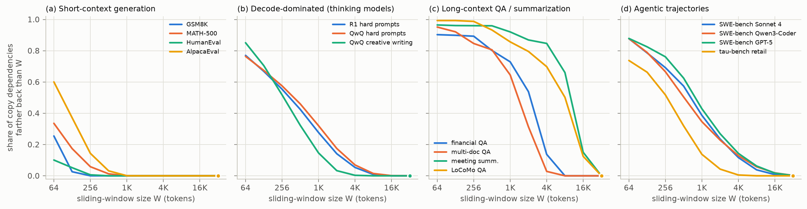
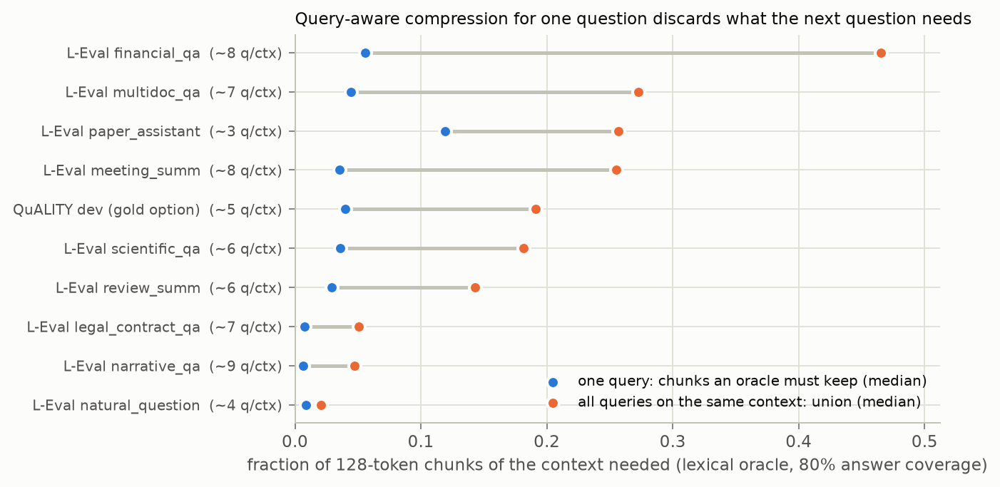
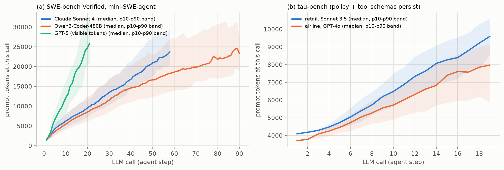
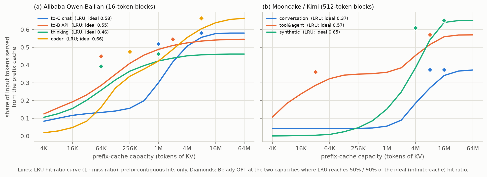

# Empirical workload characterization

This chapter measures the workload properties that the taxonomy relies on. Everything is computed from public data
by the scripts in [`analysis/`](../analysis). All numbers below are regenerated into [`tables.md`](tables.md), which
is the authoritative version. Token counts use the Llama-3 tokenizer, rebuilt offline from llama.cpp's vocabulary
and checked to reproduce its reference token ids exactly.

## 0. Data

| Kind | Source (public) | What we used |
|---|---|---|
| Short-context benchmarks | GSM8K, MATH-500 (PRM800K split), AIME 2024, BBH (27 tasks, 3-shot CoT), HumanEval, MBPP, IFEval | prompts, reference solutions |
| Chat benchmarks with real model outputs | AlpacaEval 2 (6 models × 805 prompts); Arena-Hard v0.1 (GPT-4-0314) and v2.0 (o3-mini, Gemini-2.0-Flash, DeepSeek-R1, QwQ-32B incl. visible thinking; 750 prompts each); MT-Bench (GPT-4 references); MT-Bench-101 (1,388 dialogues) | prompts, outputs, reasoning traces |
| Long-context benchmarks | L-Eval (20 tasks, 508 documents); QuALITY dev (2,086 questions); CrossCodeEval (4 languages, 9,928 samples, BM25 cross-file context); LoCoMo (10 conversations, 1,986 questions, 1,977 with resolvable gold evidence turns); LongBench-Write (120 prompts); NIAH haystack | contexts, questions, references, evidence |
| Agent trajectories | SWE-bench Verified with mini-SWE-agent: Claude Sonnet 4, Qwen3-Coder-480B, GPT-5 (500 each). τ-bench historical trajectories: GPT-4o and Claude 3.5 Sonnet, airline and retail (1,980) | full message histories; tool schemas from the τ-bench source |
| Production serving traces | Alibaba Qwen-Bailian (to-C chat, to-B API, thinking, coder; 2 h each; 16-token block hashes, sessions); Mooncake/Kimi (conversation, tool&agent, synthetic; 512-token block hashes); Azure LLM inference 2023 (code, conversation); BurstGPT (Azure OpenAI GPT-3.5/GPT-4, conversation vs API; 1.4M requests) | lengths, sessions, prefix block hashes, timestamps |

Outputs come from real models wherever we could obtain them: AlpacaEval, Arena-Hard, and the agent trajectories.
Otherwise we use the reference answer, which *under-states* what a chat or reasoning model decodes. Every table
marks which it is.

---

## M1. Length profiles: where the cache comes from

*Figure 1. Median prefill vs. decoded tokens per workload (whiskers p10–p90). Colors are cache-growth regimes.
Left: benchmarks. For agents the axes are tokens prefilled vs. tokens decoded over a whole trajectory. Right:
production traces, per request.*

Selected values (full table T1):

| workload | prompt p50 | output p50 | output p90 | regime |
|---|---|---|---|---|
| GSM8K 8-shot CoT (reference) | 712 | 76 | 132 | compact |
| MATH-500 (reference) | 49 | 158 | 442 | compact |
| HumanEval / MBPP (canonical) | 117 / 94 | 46 / 46 | 107 / 107 | compact |
| AlpacaEval, 6 chat models | 21 | 278–461 | 569–746 | compact |
| Arena-Hard v2 hard prompts, o3-mini / Gemini-2.0-Flash (visible answer) | 94 | 781 / 1,275 | 1,992 / 2,914 | compact–decode |
| Arena-Hard v2 hard prompts, DeepSeek-R1 / QwQ-32B (thinking + answer) | 94 | 3,610 / 5,068 | 9,803 / 12,111 | **decode-dominated** |
| LongBench-Write (required length) | 50 | 2,196 | 10,060 | **decode-dominated** |
| L-Eval (20 tasks) | 3.5K–50.8K | 1–370 | – | **prefill-dominated** |
| QuALITY / LoCoMo QA | 6.6K / 19.5K | 1 / 5 | – | prefill-dominated |
| CrossCodeEval (4 languages) | 606–988 | 9–14 | 18–26 | compact–prefill |

**Observations**

- **O1. Benchmarks sit at the corners of the space, production sits in the middle.**
  - *Benchmarks* are either tiny, as in almost all capability benchmarks (prompt + output under 1K tokens), or
    extremely prefill-dominated, as in long-context suites (thousands to 50K+ prompt tokens and 1–10 output
    tokens).
  - *Production requests* sit in between. Median inputs are 1K (chat) to 4.5–7K (coder, Kimi). Median outputs
    are 30–470 tokens, with long tails: the 90th-percentile Qwen coder output is 1.8K and thinking output 9.2K.
  - The combination that stresses a KV cache most — **long input and long output together** — is rare in
    benchmarks: 11 of the 228 long-context tasks in our catalog (5%).
- **O2. Thinking models move the same prompts into a different regime.** On identical Arena-Hard v2 prompts:
  - the visible answer of o3-mini is 781 tokens (p50);
  - DeepSeek-R1 decodes 3,610 and QwQ-32B 5,068 (p90 9.8K / 12.1K).

  In production, thinking requests decode 43% of all tokens, versus 1–27% for every other trace. Reasoning turns
  "prefill-dominated or compact" into **decode-dominated**. Prefill-only compression is then a no-op.
- **O3. Real-output length differs from reference length by up to an order of magnitude.** AIME human solutions
  are 1.3K tokens (p50); R1-distilled models average 15.5K on AIME24 (R-KV). Chat models write 278–461 tokens
  where MT-Bench's GPT-4 references are about 220. Evaluating decode-time eviction with reference-length outputs
  (e.g. capped at 128–256 tokens) under-states the pressure.
- **O4. Code-completion traffic is the extreme prefill case.** Azure's code trace has median input 1,469 and
  output 13 tokens (1% of tokens decoded). Kimi's tool&agent requests decode 30 tokens (p50) from 6.3K. For these,
  *prefill-time* retention quality and *cross-request* reuse matter; decode-time policy hardly matters.

---

## M2. Dependency distance: how far back does generation read?

**Method.** Classic cache studies characterize a reference stream by its reuse (stack) distance distribution, from
which the miss-ratio curve of LRU follows directly (Mattson et al., 1970). We apply the same idea to decoding:

1. Every time the decoder emits an *informative* 4-gram (one containing a digit or a non-stopword) that already
   occurred earlier in the sequence, count a **copy event**.
2. Its **distance** is the gap to the *nearest* earlier occurrence. This is a lower bound on how far back the
   model had to read: it either attended to that occurrence or re-derived it.
3. **MR(W)** is the share of copy events with distance > W. It is exactly the miss ratio of a pure sliding window
   of W tokens, i.e. StreamingLLM without its sink tokens.

The metric is model-free and lexical, which has two consequences:

- It cannot see paraphrase, computed values or instruction following, so it *under-estimates* dependency.
- Because only the nearest source is used, it *under-estimates* the reach of aggregation, which needs every
  occurrence.

*Figure 2. Share of copy dependencies farther back than a sliding window of W tokens.*

| workload | copy rate | source in prompt | distance p50 / p90 | MR@512 | MR@4K |
|---|---|---|---|---|---|
| GSM8K / MATH-500 / HumanEval (reference) | 9–27% | 18–48% | 21–40 / 65–191 | 0–1% | 0% |
| AlpacaEval (Llama-3-8B-Instruct outputs) | 9% | 11% | 87 / 320 | 3% | 0% |
| Arena-Hard v2 hard prompts, R1 / QwQ-32B thinking | 29% / 31% | 5% / 4% | 345–407 / 2,690–3,269 | 42% / 46% | 5% / 7% |
| Arena-Hard v2 creative writing, QwQ-32B thinking | 11% | 8% | 275 / 1,324 | 32% | 0% |
| CrossCodeEval python | 12% | 97% | 341 / 1,332 | 40% | 1% |
| L-Eval QA (financial / multi-doc / legal) | 30–95% | 94–100% | 1.4K–9.1K / 2.9K–21.9K | 80–93% | 3–81% |
| L-Eval summarization (gov report / meeting) | 11–36% | 92–97% | 2.2K–9.8K / 6.2K–17.0K | 89–96% | 21–85% |
| LoCoMo QA | 13% | 100% | 8.3K / 17.0K | 93% | 70% |
| MT-Bench-101 final turn | 5% | 78% | 62 / 198 | 0% | 0% |
| SWE-bench agents (3 models) | 40–58% | 12–17% | 522–794 / 4.6K–5.7K | 50–62% | 12–14% |
| τ-bench (retail Sonnet 3.5 / airline GPT-4o) | 33% | 6–10% | 285–322 / 1.3K | 28–32% | 1% |

**Observations**

- **O5. Short-context generation is window-friendly.** Everything a CoT solution, a function body or a chat
  answer copies lies within ~320 tokens (p90), so a 512-token window misses ≤ 3%.

  Why short-gen tasks still degrade under compression (KVFundaBench: arithmetic −17% to −43%): the *ratio*
  budgets used in such studies shrink the cache below a few hundred tokens, which is below this dependency
  horizon.
- **O6. Thinking traces are long-range and self-referential.**
  - 42–46% of their verbatim dependencies lie beyond 512 tokens, and the p90 distance is 2.7–3.3K.
  - Only 4–5% point into the prompt; the rest point into the model's own earlier reasoning.

  So the relevant information is created during decoding, and a policy tuned on prompts (observation windows,
  prefill scores) has nothing to act on. This quantifies what LazyEviction ("importance recurrence"), R-KV and
  SCOPE describe qualitatively.
- **O7. Creative long generation is shorter-range than reasoning.** For the same model (QwQ-32B), creative
  writing has MR@4K = 0% vs 7% for hard prompts. Its main risk is `persistent` constraints and coherence, which
  lexical copying does not capture. This is why `long_gen` and `long_reason` are separate archetypes.
- **O8. Long-context QA and summarization read from arbitrarily far back.**
  - Median copy distances are 1.4K–9.8K tokens, and in legal-contract QA 81% of copy sources are beyond 4K.
  - Sliding windows are therefore hopeless (StreamingLLM's FAQ says as much), and the outcome depends entirely on
    whether importance scoring keeps the right far-away tokens.
- **O9. Agents combine both patterns.**
  - 40–58% of agent output n-grams are copies (commands, file paths, identifiers). That is far above any other
    generative workload: chat 9%, thinking traces ~30%.
  - Most come from recent observations or the agent's own earlier commands, but 12–14% reach beyond 4K tokens.
  - Only 1–5% of copies point into the initial system/task prompt, although agents must *obey* it throughout.
    Instruction-type (`persistent`) dependencies are enforced by behavior, not copying, so a lexical metric
    cannot see them. Test them directly (IFEval-style checks, τ-bench policy violations, the Pitfalls
    methodology).

---

## M3. Evidence scope and multi-query overlap

**Method.**

- **Scope.** We cut each context into 128-token chunks. Greedy set cover then finds the fewest chunks containing
  80% of the reference answer's content words that occur in the context: a lexical oracle of the smallest budget
  that still holds the answer's sources.
  - *k80*: the number of chunks needed.
  - *scope80*: k80 ÷ total chunks.
  - *spread80*: the span of the selected chunks.
- **Multi-query overlap.** For documents that come with several questions, we compute:
  - the **union** of the questions' chunk sets (what a compressed cache must keep to answer *all* of them);
  - the mean pairwise **Jaccard** of those sets.
- **Gold evidence.** LoCoMo provides evidence turns, so we measure exact evidence distances and depths.

*Figure 3. One question vs. all questions on the same document: fraction of 128-token chunks an oracle must keep.*

| task (L-Eval unless noted) | k80 | scope80 | spread80 | union over questions | pairwise Jaccard |
|---|---|---|---|---|---|
| narrative_qa (8.7 q/doc) | 2 | 1% | 23% | 5% | 0.02 |
| legal_contract_qa (6.7 q/doc) | 1 | 1% | 1% | 5% | 0.01 |
| financial_qa (8.5 q/doc) | 2 | 6% | 6% | 47% | 0.02 |
| multidoc_qa (6.7 q/doc) | 1 | 4% | 4% | 27% | 0.11 |
| QuALITY dev (5.2 q/doc) | 2 | 4% | 20% | 19% | 0.06 |
| meeting_summ (7.7 q/doc) | 4 | 4% | 41% | 26% | 0.06 |
| gov_report / news / tv-show summaries | 5.5–6.5 | 8–19% | 76–79% | – | – |

LoCoMo gold evidence (1,977 questions over ten 19.5K-token conversations):

| category | evidence turns | multi-evidence | farthest evidence, tokens before the question (p50 / p90) | depth p50 |
|---|---|---|---|---|
| multi-hop | 3.13 | 98% | 15,364 / 20,590 | 0.16 |
| open-domain | 2.21 | 53% | 14,947 / 19,947 | 0.24 |
| temporal | 1.17 | 12% | 10,300 / 19,048 | 0.43 |
| single-hop | 1.06 | 5% | 9,170 / 17,659 | 0.53 |
| adversarial | 1.03 | 3% | 8,910 / 17,567 | 0.53 |

**Observations**

- **O10. Single-question QA is extremely sparse; summaries are dispersed.**
  - An oracle keeps 1–2 chunks (≈1–6% of the document) for QA, but the chunks it needs for a summary span
    41–79% of the document in 5 of 6 tasks.
  - This operationalizes Goldman et al.'s scope/diffusion axes and separates `point` from `global` dependency
    without a model.
- **O11. Questions about the same document need different parts of it.**
  - Pairwise overlap is tiny (Jaccard 0.01–0.17), so the union of needs is 2–47% of the document, up to 8× the
    single-question need.
  - A cache compressed *for* question 1 (the `known_last` protocol that 83% of long-context tasks use) drops most
    of what questions 2…N need.
  - This is the mechanism behind SCBench's multi-turn collapse and KVzip's results.
  - **Practical corollary:** multi-question datasets that are normally scored one prompt at a time (L-Eval,
    QuALITY, LoCoMo with ~150–200 questions per conversation, LongMemEval, NoCha) can be served in
    *shared-context mode* (compress once, ask all). This yields `deferred`-query coverage without new data. The
    catalog records this as an alternative protocol.
- **O12. Memory evidence is old and multi-hop evidence is older.** Multi-hop questions cite 3.1 turns and reach a
  median 15.4K tokens back (depth 0.16). Single-hop evidence is uniformly placed (depth 0.53). Recency-based
  retention cannot serve conversational memory.

---

## M4. Context redundancy

| context | gzip ratio | repeated 4-grams |
|---|---|---|
| passkey filler ("The grass is green…") | **205.9** | 100% |
| SWE-bench agent observations | 4.5 | 46% |
| L-Eval codeU (repository code) | 4.6 | 45% |
| L-Eval topic retrieval (long chat) | 3.9 | 30% |
| L-Eval legal / meeting / multi-doc / gov report | 3.0–3.5 | 10–32% |
| τ-bench trajectories | 3.3 | 38% |
| LoCoMo / CrossCodeEval | 3.0 | 13–15% |
| Paul Graham essays (NIAH haystack) | 2.6 | 2% |
| QuALITY articles | 2.3 | 2% |
| JSON store of random UUIDs | **1.8** | 4% |

**Observations**

- **O13. Haystack choice changes difficulty by two orders of magnitude of redundancy.**
  - Repeated-sentence passkey haystacks are ~99.5% compressible, so any importance-based policy trivially keeps
    the lone outlier.
  - Natural-essay haystacks (2.6) and random-UUID stores (1.8) leave no redundant mass to discard.
  - Results on the first kind say little about the others.
- **O14. The most redundant real contexts are agent observations and code.** Repeated 4-grams make up 45–46% of
  SWE-bench observations and repository code: file listings, build logs, repeated file views. They are good
  eviction targets *except* for the rare identifiers inside them (O9).

---

## M5. Agent trajectories: accumulating KV

*Figure 4. Prompt size at each LLM call (median and p10–p90 band).*

| agent (SWE-bench Verified unless noted) | steps p50 (p90) | persistent prefix | peak context p50 / p90 / max | observations | model output | prefill saved by cross-step prefix reuse |
|---|---|---|---|---|---|---|
| mini-SWE-agent + Claude Sonnet 4 | 33 (64) | 1,468 | 14.3K / 25.5K / 87K | 53% | 35% | 30.7× |
| mini-SWE-agent + Qwen3-Coder-480B | 47 (130) | 1,476 | 17.2K / 42.4K / 157K | 55% | 35% | 43.7× |
| mini-SWE-agent + GPT-5 (visible output only) | 12 (21) | 1,485 | 13.4K / 27.2K / 82K | 71% | 16% | 8.6× |
| τ-bench retail, Claude 3.5 Sonnet | 13 (19) | 4,094 | 7.8K / 10.2K / 18K | 30% | 17% | 11.7× |
| τ-bench airline, GPT-4o | 11 (20) | 3,711 | 6.1K / 8.7K / 13K | 20% | 14% | 10.7× |

(Peak context = prompt + output of the last LLM call. The observation logged after an agent submits is excluded,
because it never reaches the model.)

**Observations**

- **O15. Agents are a third regime: steady, linear growth over tens of calls.**
  - Context grows by a median 310–380 tokens per step for SWE-bench agents (about 1,000 for GPT-5, which takes
    fewer, larger steps) and 180–280 for τ-bench (Figure 4). Observations dominate (53–71%), and most are
    re-read-once, compressible text.
  - A policy therefore evicts repeatedly on a growing cache, and every eviction is irreversible for all later
    steps.
  - Production agentic coding is an order of magnitude larger: TraceLab and WEKA Claude-Code traces report median
    inputs of 110–132K tokens per call, with 95.6% of input tokens cached prefix.
- **O16. Persistent instructions are a large and critical share.** τ-bench's policy document plus tool schemas
  (3.7–4.1K tokens) is 52–61% of the median peak context and must be obeyed at every step. Any policy that ages
  out early tokens (sink + window) or scores tokens by attention to the latest turn (Pitfalls) puts compliance at
  risk.
- **O17. Cross-step prefix reuse saves 9–44× prefill.** The number depends on model verbosity and step count.
  Token-level eviction that rewrites earlier KV (compaction, merging) can break byte-identical prefixes and forfeit
  this saving; this is an interaction between intra- and cross-request eviction that benchmarks do not test.

---

## M6. Production serving traces: cross-request reuse

**Method.** We replay each trace against a prefix cache:

- A request reuses the *longest leading run* of its block hashes that is resident. The hashes are prefix-chained:
  we verified that runs never resume after a miss in the Mooncake, thinking and coder traces.
- Within a request, ancestors are touched after descendants, so LRU never evicts a prefix before its extensions,
  as in vLLM and SGLang.
- The *ideal* hit ratio uses an infinite cache.
- LRU miss-ratio curves come from one-pass stack distances (Mattson). FIFO, LFU and Belady's OPT are simulated
  at the capacities where LRU reaches 50% and 90% of the ideal.
- **Cross-check.** An independent re-implementation by a separate agent reproduced the ideal hit ratios within
  ±2 points (Qwen to-C 0.58 with 71% same-session hits; Mooncake 0.37 / 0.55–0.57 / 0.64–0.65). Mooncake's
  paper reports 3–6 points higher; the gap likely comes from accounting details such as whether generated
  blocks are cached.

*Figure 5. Share of input tokens served from a prefix cache vs. capacity (LRU), with Belady-OPT points.*

| trace | input p50 / p90 | output p50 / p90 | decoded share of tokens | follow-up turns | ideal hit | hits from same session |
|---|---|---|---|---|---|---|
| Qwen to-C chat | 1,046 / 6,436 | 376 / 808 | 16% | 46% | 58% | 72% |
| Qwen to-B API | 574 / 1,720 | 39 / 180 | 9% | 0% | 55% | 0% |
| Qwen thinking | 3,680 / 13,115 | 1,666 / 9,157 | 43% | 11% | 46% | 30% |
| Qwen coder | 4,540 / 12,776 | 469 / 1,789 | 12% | 39% | 66% | 45% |
| Mooncake conversation | 6,909 / 27,367 | 350 / 597 | 3% | n/a | 37% | n/a |
| Mooncake tool&agent | 6,346 / 16,806 | 30 / 507 | 2% | n/a | 57% | n/a |
| Azure'23 code / conversation | 1,469 / 1,020 | 13 / 129 | 1% / 15% | n/a | n/a | n/a |
| BurstGPT conversation (GPT-3.5 / GPT-4) | 533 / 576 | 229 / 240 | 24–27% | n/a | n/a | n/a |

Policy comparison (share of input tokens served from cache; best in bold):

| trace | capacity | LRU | FIFO | LFU | OPT |
|---|---|---|---|---|---|
| Qwen to-C chat | 1M tokens | 0.300 | 0.266 | 0.230 | **0.520** |
| Qwen to-B API | 64K tokens | 0.286 | 0.255 | 0.406 | **0.450** |
| Qwen thinking | 64K tokens | 0.259 | 0.228 | 0.263 | **0.393** |
| Qwen coder | 256K tokens | 0.337 | 0.254 | 0.307 | **0.475** |
| Mooncake conversation | 8M tokens | 0.271 | 0.242 | 0.231 | **0.374** |
| Mooncake tool&agent | 32K tokens | 0.286 | 0.264 | 0.353 | **0.361** |

Reuse timing (time since the block's previous use, p50 / p90):

- to-C chat: **132 s / 703 s** for same-session reuse, vs **0.5 s / 23 s** for cross-session reuse.
- coder: 87 s / 779 s (same session) vs 2.9 s / 106 s (cross session).
- to-B API: 3 s / 73 s (cross session).

**Observations**

- **O18. The source of reuse differs by service, and so does the best policy.**
  - *To-B API* traffic reuses only shared templates: 0% same-session. Frequency wins there: LFU recovers 90% of
    OPT at a 64K-token cache, while LRU recovers 64%.
  - *To-C chat* reuse is 72% within sessions, separated by human think time (median 132 s). LFU is worst there
    (0.23 vs OPT 0.52 at 1M tokens), because each session's history is referenced only a few times.
  - *Agent loops* (Mooncake tool&agent) are extremely recency-friendly: half the achievable reuse at 32K tokens.
  - A single "real-world trace" therefore cannot validate a cross-request policy. It has to be tested on each
    stream archetype.
- **O19. The LRU-to-OPT gap is large exactly where sessions pause.** At the capacity where LRU reaches half of the
  ideal, OPT is 1.4–1.7× better on chat, coder, thinking and conversation traces. This is the headroom that
  session-aware, TTL- or prediction-based policies target (CachedAttention, KVCache-in-the-wild, Continuum,
  KVFlow).
- **O20. Reasoning output is large but rarely reused.** Thinking requests decode 43% of all tokens, yet only 30%
  of their prefix hits come from the same session: reasoning is stripped from the next turn's context. Caching
  decode-generated KV for these workloads mostly pollutes the cache, which argues for admission control.
- **O21. Session reuse arrives after minutes, shared-prefix reuse within seconds.** Tool loops take ~1 s
  (TraceLab median 1.0 s), human turns ~2 minutes (Bailian 132 s, TraceLab 121 s, BurstGPT 124 s). Capacity-bound
  and TTL-bound caches therefore behave very differently on the same trace: a 5-minute TTL covers the median
  human gap but not its p90 of 12 minutes.

---

## Summary: what the measurements establish

1. **Capability does not predict KV behavior.** Math, code and chat each span several regimes (M1, M2).
2. **Four orthogonal stressors** separate workloads:
   - where KV comes from (growth);
   - how far back and how widely generation reads (dependency distance and scope);
   - whether future needs are known at compression time (single vs. multiple queries);
   - how exact the retained information must be.

   Each shows order-of-magnitude differences across workloads: MR@512 from 0% to 96%, union scope from 2% to 47%,
   redundancy from 1.8 to 206.
3. **The regimes that dominate modern deployment are the least evaluated.** Thinking models, agents and
   multi-turn sessions are decode-dominated, accumulating or deferred-query. The eviction literature evaluates
   mostly compact or prefill-dominated, single-query workloads (see
   [literature §2](literature.md#2-which-workloads-kv-eviction-papers-evaluate-on) and the coverage matrix in
   [benchmark_mapping.md](benchmark_mapping.md)).

**Threats to validity**

- Lexical dependency metrics are lower bounds (paraphrase, computation and instruction-following are invisible).
- Reference outputs under-state real decode lengths.
- Chunk-cover scope depends on the chunk size and the stop-list.
- Traces are 1–2-hour samples.
- Block hashes of different sizes (16 vs 512 tokens) limit cross-trace comparison of absolute capacities.
- Mooncake timestamps are coarse (1-second resolution, many ties), which compresses its reuse-time distribution.
