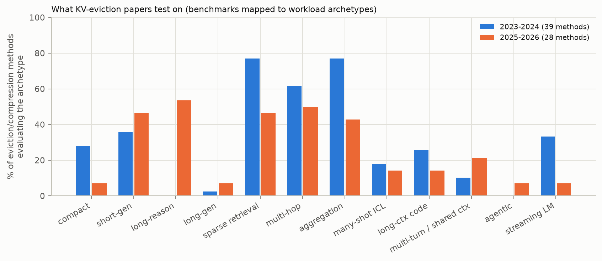

# How academia and industry categorize LLM workloads, and what KV-eviction research tests on

This chapter summarizes four literature surveys run for this study:

1. general capability taxonomies;
2. long-context and long-output benchmark suites (228 tasks, 29 suites);
3. KV-cache eviction/compression methods and evaluation studies (76 unique records);
4. industry usage studies, production traces and cross-request KV management.

The full evidence notes are in [`notes/`](notes), with per-fact confidence tags and source URLs. The task- and
method-level tables are in [`taxonomy/sources/`](../taxonomy/sources). Citations are keyed to
[references.md](references.md).

**Sourcing.** arXiv, OpenReview, ACL Anthology and Hugging Face were not reachable from the research environment.
Facts were therefore taken, in order of preference, from:

1. official repositories (READMEs, configs, prompt templates, released data and result files);
2. data we downloaded and measured ourselves;
3. search-engine abstracts.

Claims that rest only on the last source are marked *(abstract-level)*.

---

## 1. How the field categorizes LLM workloads

### 1.1 General capability taxonomies

The sixteen sources we compared are:

- HELM, BIG-bench keywords;
- Open LLM Leaderboard v1/v2, OpenCompass, LiveBench, LMArena categories, the Artificial Analysis Intelligence
  Index;
- the evaluation tables of Llama 3, Qwen3, DeepSeek-V3/R1, Gemini 2.5, OpenAI and Claude;
- the surveys of Chang et al. and Guo et al.

They converge on about ten recurring top-level categories:

| category | present in | typical benchmarks |
|---|---|---|
| Knowledge / expert QA | essentially all | MMLU(-Pro), GPQA, HLE, SimpleQA |
| Reasoning (math usually separate) | nearly all | BBH, MuSR; GSM8K, MATH, AIME |
| Coding | all model reports, LMArena, LiveBench, AA | HumanEval → LiveCodeBench → SWE-bench, Terminal-Bench |
| Instruction following / chat preference (absorbs creative writing and multi-turn) | HELM-Capabilities, OLL v2, LMArena, model reports | IFEval, AlpacaEval, Arena-Hard, MT-Bench |
| Tool use / agents | AA (30% of the index weight *(abstract-level)*), Llama 3, Qwen3, Gemini, Claude, surveys | BFCL, τ-bench, Terminal-Bench, GAIA, WebArena, OSWorld |
| Long context | OpenCompass, BIG-bench, LMArena "longer query", model reports | RULER, LongBench, MRCR, LOFT |
| Multilingual | most | MGSM, MMMLU |
| Safety / truthfulness | HELM metric axes, system cards | TruthfulQA, BBQ |
| Domain / professional | OpenCompass exams, LMArena occupations, AA GDPval | MedQA, LegalBench |
| Legacy commonsense | HELM, OLL v1 | HellaSwag, Winogrande, ARC |

HELM is the one scheme that is explicitly *two-dimensional*: scenarios × metrics. BIG-bench's keyword tree is the
only one with KV-relevant keywords: "context length", "multi-step", "repeated interaction".

**The trend is monotone toward heavier KV workloads.** Leaderboards moved through four stages:

1. log-likelihood multiple choice (OLL v1, HELM Classic): no decoding;
2. short generative chain-of-thought (OLL v2): hundreds of tokens;
3. long reasoning: AIME and GPQA with 32K-token budgets; DeepSeek-R1's cap is 32,768 and Qwen3's up to 38,912;
4. multi-step agent work: the AA index now weights agents 30%, and step limits rose to 250.

Each stage moves the KV profile from compact to decode-dominated to accumulating. Standard templates for older
benchmarks keep prompts short: MMLU 5-shot about 680 tokens, GSM8K 8-shot about 716.

### 1.2 Long-context taxonomies

| suite | organizing principle | KV-relevant remark |
|---|---|---|
| LongBench v1 (21 tasks) | application: single-/multi-doc QA, summarization, few-shot, synthetic, code | question after the context; outputs capped at 32–512 tokens; inputs truncated from the *middle* |
| LongBench v2 (503 MCQs) | application: 6 categories, 20 sub-domains | answers are letters (`exact_low_entropy`) |
| RULER (13 tasks) | capability: retrieval / multi-hop tracing / aggregation / QA, with complexity knobs | haystack types (noise / essays / all-needle) and value types (words / numbers / UUIDs) are exactly the redundancy and fidelity facets |
| InfiniteBench (12 tasks) | realistic vs synthetic × domain | includes the rare long-output Math.Calc (≈44K in, 44K out) |
| HELMET (7 categories) | application: recall, RAG, re-rank, citation, long QA, summarization, ICL | finds synthetic recall predicts downstream tasks poorly; ICL is the least correlated category (0.36–0.63) |
| LooGLE | short vs long dependency | the only suite that makes dependency *range* explicit |
| Goldman et al. 2024 | diffusion (how hard to find) × scope (how much is needed) | the high-diffusion, high-scope quadrant is under-explored |
| Michelangelo | latent-structure queries (Latent List, MRCR, IDK) | state tracking, verbatim reproduction, absence detection *(details from recollection)* |
| SCBench (12 tasks) | KV-cache lifecycle: 4 capabilities × {multi-turn, multi-request} | the only suite that sends a second, different query to the same cache |
| LCLM survey (2025) | retrieval / aggregation / reasoning / generation | long-form generation as its own category |

Across all 228 catalogued long-context tasks, seven systematic gaps stand out:

1. **The question comes after the context in 83% of tasks** (189/228). Only HELMET's ALCE puts it first. This
   favors query-aware compressors.
2. **One compressed cache serves one question.** L-Eval, LooGLE, NoCha, LongMemEval and LoCoMo ask many questions
   per document but score each as a separate prompt.
3. **Outputs are short.** Most are ≤ 128 tokens; long-input + long-output appears in 11 of 228 tasks (5%).
4. **The high-scope, high-diffusion quadrant is thin**: LooGLE long-dependency, Loong clustering/chain,
   BookSumSort, book summarization.
5. **Few tasks require a current value over a stale one.** Examples are BABILong qa1–3, RULER VT, LongMemEval
   knowledge-update and Counting-Stars reasoning. This is exactly where recency-biased eviction behaves
   differently.
6. **Abstention is rare** (Qasper, IDK, LongMemEval abstention, LoCoMo adversarial), yet eviction can turn "not
   present" into a hallucination.
7. **Chat histories are flattened into one prompt** (LongMemEval, LoCoMo, LongBench v2 dialogue). Only SCBench and
   MRCR preserve turn structure at inference.

---

## 2. Which workloads KV-eviction papers evaluate on

### 2.1 The evaluation record, quantified

We mapped the evaluated benchmarks of every characterized method onto our archetypes with keyword rules
(`analysis/literature_coverage.py`; per-method results in `results/literature_coverage.csv`). There are 67
token-level eviction/compression methods; evaluation-only studies and serving-level systems are excluded.

| archetype | 2023–2024 (39 methods) | 2025–2026 (28 methods) |
|---|---|---|
| compact | 28% | 7% |
| short_gen | 36% | 46% |
| **long_reason** | **0%** | **54%** |
| long_gen | 3% | 7% |
| sparse_retrieval | 77% | 46% |
| multi_hop | 62% | 50% |
| aggregation | 77% | 43% |
| many_shot_icl | 18% | 14% |
| lc_code_struct | 26% | 14% |
| **shared_context_multiturn** | **10%** | **21%** |
| **agentic** | **0%** | **7%** (two 2026 preprints) |
| streaming_lm | 33% | 7% |
| median archetypes per method | 4 | 2.5 |

The literature falls into four eras:

1. **2023, decode-time accumulated-attention methods** (H2O, Scissorhands, Keyformer, CaM, LESS, InfiniGen):
   lm-eval-harness multiple choice (COPA, PIQA, Winogrande, OpenBookQA, MathQA, RTE), HELM short summarization
   (XSum, CNN/DM) and perplexity. Prompts are under 2K tokens, and multiple-choice scores are often *simulated by
   attention masking* rather than physical eviction.
2. **Streaming methods** (StreamingLLM, LM-Infinite, SirLLM, TOVA, InfiniPot): perplexity over million-token
   streams, streaming QA, passkey, bespoke multi-turn memory tasks.
3. **Mid-2024 prefill-compression methods** (SnapKV, PyramidKV, Ada-KV, CAKE, HeadKV, DuoAttention, RazorAttention,
   DynamicKV, ThinK, NACL, VATP): **LongBench (16 English tasks) + Needle-in-a-Haystack**, later RULER.
   Long-prompt, short-answer, single-query, question-last.
4. **2025–26 diversification.**
   - Reasoning-model decode compression (R-KV, LazyEviction, RPC, ThinKV, G-KV, SeerAttention-R, DMS, RLKV) on
     AIME / MATH-500 / LiveCodeBench / GPQA with R1-distilled, QwQ and Qwen3 models.
   - Long generation (SCOPE, MorphKV).
   - Context reuse and multi-turn (KVzip, TRIM-KV, EpiCache, FlowKV, RocketKV, LoopServe).
   - Only 2026 preprints on agent trajectories (StepKV on BrowseComp-Plus; Nexus Sampling on SWE-bench), mostly
     known at title/abstract level.

Newer methods cover *fewer* archetypes each (median 2.5 vs 4). They specialize: reasoning-compression papers
evaluate only reasoning. Cross-archetype regressions therefore go unmeasured. A reasoning-tuned policy is rarely
checked on retrieval, and vice versa.

### 2.2 Method families and the workload property each exploits

| family | examples | assumption about the workload | the archetype where the assumption fails |
|---|---|---|---|
| sink + recent window | StreamingLLM, LM-Infinite | dependencies are local (`local`) | any long-range dependency: retrieval, multi-hop, memory |
| accumulated attention (heavy hitters) | H2O, Scissorhands, Keyformer, TOVA | importance persists over time | `evolving` needs: reasoning recurrence, follow-up queries |
| observation window at the end of the prompt | SnapKV, PyramidKV, Ada-KV, CAKE, HeadKV, DynamicKV | the query is the last part of the prompt and is fixed | `deferred` / `known_first` queries; decode-dominated growth |
| head-level full/streaming split | DuoAttention, RazorAttention | retrieval heads are few and fixed | reasoning heads differ from retrieval heads (RLKV); GQA needs ~50% of heads |
| query-agnostic / reconstruction | KVzip, Expected Attention, KeyDiff, Q-Filters, TRIM-KV | future queries are unknown | tight budgets on exact retrieval |
| decode-time redundancy / reasoning-aware | R-KV, LazyEviction, RPC, ThinKV, SCOPE, MorphKV | self-generated text is redundant; importance recurs | prompt-anchored exact retrieval (untested) |
| recallable / non-evicting sparsity | Quest, ArkVale, InfiniGen, ShadowKV, MagicPIG, RetrievalAttention | keep everything, fetch a subset | aggregation (flat attention) for top-k variants |

---

## 3. What the evaluation studies found

Evaluation-only studies are the strongest evidence for which workload properties matter:

- SCBench;
- Yuan et al. ("What must we give in return?");
- KVFundaBench;
- The Pitfalls of KV Cache Compression;
- Rethinking KV-cache compression for serving (MLSys'25);
- Hold Onto That Thought;
- KVDiagnosis;
- the 2026 query-visibility audit;
- NVIDIA kvpress.

The mechanistic analyses add further evidence: retrieval heads, DuoAttention, MagicPIG, DynamicKV, Lost in the
Middle, HELMET, Goldman et al.

| # | evidence-backed claim | support | taxonomy facet |
|---|---|---|---|
| 1 | Exact retrieval of high-entropy, incompressible spans is the most eviction-fragile workload, especially when the query is hidden. | NACL (repo results, likely): InfiniteBench Retrieve.KV 0.59 → 0.04 at 80% eviction while passkey/summary hold. KVzip: SnapKV ≈9 vs ≈60 (full) on Retr.KV at 50% cache. DynamicKV: NIAH at a 64-token cache, StreamingLLM 26% vs full 92%. KVDiagnosis: StreamingLLM 57 vs full 97 on RULER-8K at 50%. | fidelity `exact_high_entropy`, query `deferred` |
| 2 | Answer-span length is a hidden variable. | Yuan et al.: H2O 100% on 7-digit but 35% on 64-digit passkeys at 4×. kvpress contributors: needles "found but miscopied" (UUIDs). | fidelity; flag `short_answer` |
| 3 | Query visibility changes scores *and rankings*. | kvpress hides the question by default ("artificially favors SnapKV"). KVzip: query-aware methods degrade even at 90% budget in multi-query use. 2026 audit: with the query hidden, SnapKV loses to trivial baselines; only KeyDiff wins 31/36 cells *(abstract-level)*. | query `deferred` |
| 4 | Multi-turn reuse breaks sub-linear-memory methods. | SCBench: "Sub-O(n) memory is almost infeasible in multi-turn decoding". | archetype `shared_context_multiturn` |
| 5 | Redundant global tasks degrade gracefully; non-redundant aggregation does not. | KVzip: summaries, many-shot ICL, Math.Find degrade gradually. MagicPIG: top-k attention "severely degrades" on CWE/FWE *(abstract-level)*. | dependency `global`, redundancy |
| 6 | Arithmetic and code contexts behave like retrieval. | KVFundaBench: arithmetic −17% to −43% while knowledge/commonsense resist *(abstract-level)*. KVzip: GSM8K ≈32 vs ≈69 at 50%. | archetype `short_gen`, fidelity |
| 7 | Parametric knowledge masks eviction damage. | Retrieval-head masking barely hurts knowledge answers (Wu et al.). Lost in the Middle: mid-context GPT-3.5 falls below its closed-book score. | dependency `parametric`, flag `parametric_leakage` |
| 8 | Evidence position and recency matter. | StreamingLLM needs sinks (PPL 5.40 vs 5,158), yet on LongBench 4 + 3,496 underperforms truncation because it loses the preamble. DuoAttention: most heads attend only to sinks + recent tokens. | position; dependency `local` / `persistent` |
| 9 | Long outputs need decode-time policies; importance drifts or recurs. | SCOPE ("heavy hitters deviate"), LazyEviction ("importance recurrence"), MorphKV, R-KV, RLKV, Hold Onto That Thought, SCBench ("long-generation distribution shift"). | growth `decode_dominated`, query `evolving` |
| 10 | Compression changes output length, with a heavy tail of runaway and looping outputs. | Rethinking-KV: >20% of samples ≥ 1.5× longer. Re-analysis of its logs: aggressive settings push 15–28% of naturally terminating responses to the length cap. Hold Onto That Thought: low budgets lengthen reasoning traces. | flag `output_length_unreported` |
| 11 | Multi-instruction prompts are a distinct fragile class. | Pitfalls (ACL'26): some instructions are effectively ignored and system-prompt leakage rises; "fair eviction" and whitelisting fix it. | dependency `persistent` |
| 12 | Rankings flip across workloads. | KVDiagnosis: KeyDiff 90.7 on RULER-8K but 51.5 on HotpotQA (full 74.0). Yuan et al.: token dropping is strong on code completion. Hold Onto That Thought: no single best method for Llama-3.1-8B. | the reason a covering suite is needed |
| 13 | Head and layer importance is task-dependent. | < 5% of heads are retrieval heads (Wu et al.). DuoAttention needs 25% (MHA) / 50% (GQA) of heads at full cache for NIAH parity. DynamicKV: layer profiles differ by task. RLKV: reasoning heads ≠ retrieval heads. | dependency type |
| 14 | Averages hide non-overlapping per-sample failures. | KVDiagnosis: 12,520 right→wrong vs 1,004 wrong→right flips; SnapKV–TOVA failure-set Jaccard 0.14–0.38. | protocol: paired per-sample reporting |
| 15 | Synthetic NIAH alone is unrepresentative. | HELMET: synthetic recall poorly predicts downstream tasks. RULER: NIAH saturates. Goldman et al.: benchmarks cluster in the easy quadrant. | archetype coverage |

Studies still missing, which this taxonomy makes explicit:

- no study correlates *compression-induced* score changes across task families (HELMET's correlations are across
  models, not compression methods);
- no token-level study uses real agent trajectories;
- no study combines long prompt + long output + multi-turn.

---

## 4. What real deployments look like

### 4.1 Usage mix

| source | finding | confidence |
|---|---|---|
| Anthropic Clio (1M Claude.ai conversations, 2024) | web/mobile app development > 10%; content creation ~9%; education > 7%; business strategy ~6% | verified (exact shares abstract-level) |
| Anthropic Economic Index (Sep 2025 – Jun 2026) | coding 34–40% of Claude.ai and 44–46% of first-party API traffic; 77% of API business use follows automation patterns vs ~50% on Claude.ai (Sep 2025); a Claude Code session is typically *one* human prompt with many tool steps, vs 13 rounds for a chat blog post (Jun 2026) | verified |
| OpenAI/NBER "How People Use ChatGPT" (2025) | practical guidance ~29%, seeking information 24%, writing 24%, programming 4.2%; non-work 73% | abstract-level |
| OpenRouter "State of AI" (100T tokens, 2025) | programming grew from ~11% to > 50% of *tokens*; average prompt grew ~1.5K → 6K tokens; reasoning models > 50% of tokens | abstract-level |
| WildChat (1M ChatGPT conversations) | creative / assisting writing 61.9%, coding 6.7%; 2.5 turns on average | abstract-level |
| ShareGPT (as used by vLLM benchmarks) | 3.5 human turns per conversation, but vLLM's sampler keeps only the first turn (≤ 1,024-token prompt), so **no multi-turn structure and no prefix reuse** | verified (computed) |

Counting *requests*, consumer chat is dominated by guidance, information and writing. Counting *tokens* — what
occupies KV memory — long-context coding and agents dominate. A representative test mix must specify its
weighting.

### 4.2 Production traces

| trace | contents | headline (this study unless noted) |
|---|---|---|
| Azure LLM inference 2023 (Splitwise) | code & conversation lengths | code: 1,469 in / 13 out; conversation 1,020 / 129 |
| Azure 2024 (DynamoLLM, 1 week) | lengths, timestamps | code 1,930 / 8; strong diurnal swing, 33× peak/trough for code *(companion survey)* |
| BurstGPT (Azure OpenAI; KDD'25) | lengths, conversation vs API, sessions | 89% of rows are API calls; conversation sessions average 4.2 turns, median think time 124 s *(companion survey)* |
| Mooncake / Kimi (FAST'25) | 512-token prefix hashes; conversation, tool&agent, synthetic | ideal prefix hit 37% / 57% / 65%; tool&agent reuse is extremely short-range |
| Qwen-Bailian (ATC'25 "KVCache Cache in the Wild") | 16-token hashes, sessions, request type; to-C, to-B, thinking, coder | to-C 72% same-session reuse, to-B 100% cross-session; thinking decodes 43% of tokens |
| ServeGen (Alibaba, NSDI'26) | per-client distributions, hashed conversations | 3.5 turns, median inter-turn gap 308 s *(companion survey)* |
| TraceLab (Claude Code / Codex, 2026) | 665K rounds from 52 developers | median input 132K tokens, 95.6% cached prefix; tool gap ~1 s vs human gap ~121 s *(companion survey, computed from the release)* |
| WEKA kv-cache-tester (Claude Code) | 739 traces, 64-token per-session hashes | median input 110K; consecutive-request hit rate ~96%; tools + system ≈ 15K tokens *(companion survey)* |

### 4.3 Cross-request KV management and eviction

| system | policy | workload property exploited |
|---|---|---|
| vLLM automatic prefix caching | LRU over free full blocks, tail blocks first | recency; prefix depth |
| SGLang RadixAttention (+ HiCache) | LRU on radix-tree leaves, plus lfu / slru / priority / T-LRU options; tiered storage | shared few-shot / self-consistency / multi-turn / tree-search / agent prefixes |
| Mooncake store, LMCache | approximate LRU with leases and soft pinning of hot prefixes / LRU, LFU, FIFO options | hot shared prefixes; tiering |
| CachedAttention (ATC'24), Pensieve (EuroSys'25) | session-aware prefetch/eviction from queue look-ahead; recency × recompute cost | multi-turn sessions |
| KVCache-in-the-wild policy (ATC'25) | reuse-probability priority per request category | category-specific reuse times *(abstract-level: +3.9% hits, up to 41% lower latency vs LRU)* |
| Marconi (MLSys'25) | admission filter + FLOP-aware eviction | unequal recompute value (hybrid models) |
| RAGCache, CacheBlend | prefix-aware GDSF; non-prefix chunk reuse | document popularity; RAG chunk reuse |
| InferCept, Continuum, KVFlow, TokenCake | discard/keep/swap during tool pauses; tool-call TTL pinning; workflow-distance eviction; agent-aware offload | tool-call pauses; agent step graphs |
| Provider prompt caches (e.g. Anthropic) | 5-minute (or 1-hour) TTL refreshed on hit | TTL- / cost-bound regime |

An independent, not peer-reviewed replay study found plain radix-leaf LRU hard to beat under capacity pressure. Its
TTL-300 s variant never fired. In TTL-bound provider caches, eviction costs are large (AgentSysBench *(abstract-level)*: 31.5% of
cost). Policy value therefore depends on the regime: capacity-bound engine caches vs TTL-bound provider caches.

---

## 5. Synthesis: the evaluation gap

| | what deployments look like | what eviction papers test on |
|---|---|---|
| **Cache growth** | decode-dominated (thinking: 43% of tokens decoded) and accumulating (agents: tens of calls; production coding agents at 110–132K tokens per call) | mostly prefill-dominated single calls (2023–24: 77% sparse retrieval, 0% long reasoning, 0% agents) |
| **Query timing** | deferred: 46% of chat requests are follow-ups; context caching, shared documents | known, and after the context, in 83% of long-context tasks |
| **Outputs** | hundreds to tens of thousands of tokens | ≤ 128 tokens in most long-context tasks |
| **Persistent instructions** | system prompts, tool schemas and policies (τ-bench: 52–61% of the context) | rarely tested (Pitfalls, 2025–26) |
| **Cross-request reuse** | same-session (to-C), cross-session (to-B), agent loops | the standard ShareGPT sampler has none |

The taxonomy in [taxonomy.md](taxonomy.md) is designed to make this gap visible and measurable per suite. The
coverage tool in [benchmark_mapping.md](benchmark_mapping.md) computes it for any benchmark collection.
