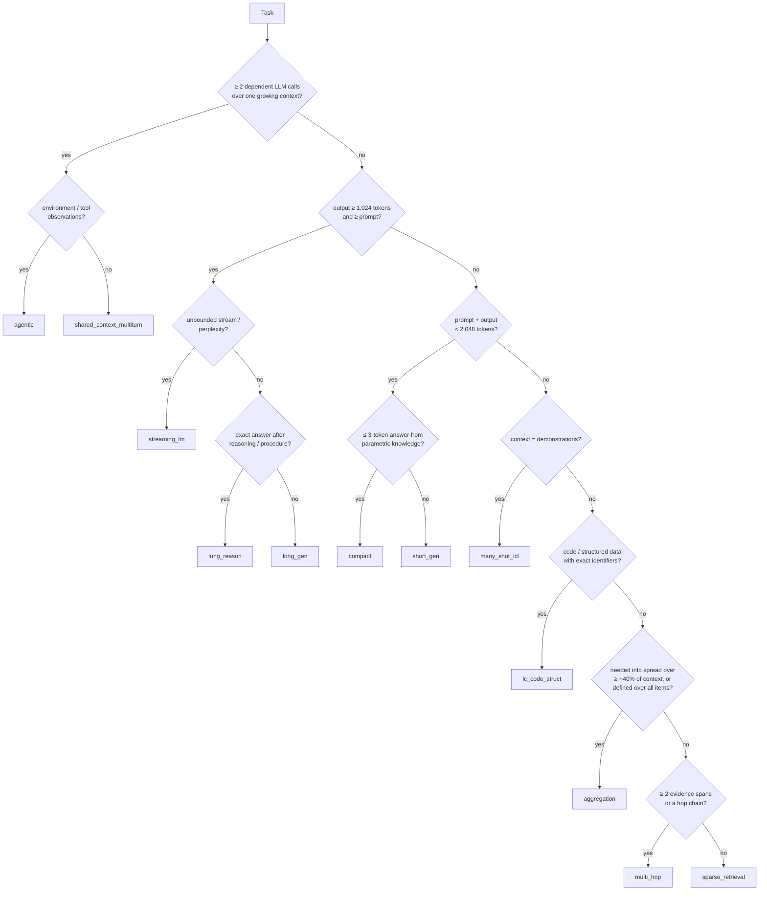

# A KV-cache-stress taxonomy of LLM inference workloads

*Version 1.0 — the machine-readable form is [`taxonomy/taxonomy.yaml`](../taxonomy/taxonomy.yaml); every benchmark
task we catalogued is mapped in [`taxonomy/benchmarks.yaml`](../taxonomy/benchmarks.yaml).*

This document defines the categorization that the rest of the study uses. It has two layers:

1. **Capability domain**: what the task is about (math, code, knowledge, ...). This is how academia and industry
   report results, and it is needed to keep a test suite representative of real use.
2. **KV-stress signature**: eight facets that determine *how an eviction policy can hurt the task*. The signature
   partitions workloads into **12 request-level archetypes** (for token-level KV eviction) and **6 stream-level
   archetypes** (for cross-request prefix-cache eviction).

Coverage of a suite is judged on layer 2; layer 1 keeps the suite realistic.

---

## 1. Why capability categories are not enough

Every general taxonomy we surveyed organizes tasks by capability:
HELM's scenario × metric grid, BIG-bench's keyword tree, OpenCompass's dimensions, the Open LLM Leaderboard,
LMArena categories, the Artificial Analysis index, and the evaluation tables of Llama 3, Qwen3, DeepSeek-V3/R1,
Gemini 2.5, OpenAI and Claude. See [literature §1](literature.md#1-how-the-field-categorizes-llm-workloads).
Their recurring top-level categories are:

- knowledge
- reasoning, with math usually its own category
- code
- instruction following / chat
- agents
- long context
- multilingual
- safety
- domain / professional work

These categories do not predict KV-cache behavior. Within a single capability category, our measurements span
every cache regime:

| Capability | Task | Prefill tokens (p50) | Decoded tokens (p50) | What an eviction policy must preserve |
|---|---|---|---|---|
| math | MathQA (lm-eval, multiple choice) | tens–hundreds | 1 (log-likelihood) | almost nothing: the whole sequence fits any budget |
| math | GSM8K 8-shot CoT | 712 | 76 (reference) | numbers copied within about 100 tokens (dependency distance p90 = 92) |
| math | AIME / hard prompts with a thinking model | 86–94 | 3.6K–5.1K (R1 / QwQ-32B) | self-generated intermediate results reaching back thousands of tokens (42–46% of copies are > 512 tokens back) |
| math | InfiniteBench Math.Find | ~88K | ~1 | every number in the context (flat, global attention) |
| math | InfiniteBench Math.Calc | ~44K | ~44K | running state over the whole input and output |
| code | HumanEval | 117 | 46 | identifiers from a short prompt |
| code | CrossCodeEval (cross-file) | 606–988 | 9–14 | exact identifiers defined in retrieved files (97% of copies come from the prompt) |
| code | SWE-bench Verified agent | peak 13–17K, 12–47 LLM calls | 16–35% of the context | task statement, far-back file paths and identifiers across tool observations |

Conversely, one KV behavior spans many capabilities. **Sparse retrieval** of a single evidence span appears as:

- book QA (NarrativeQA);
- JSON key–value lookup (InfiniteBench Retrieve.KV);
- repository QA (InfiniteBench Code.Debug);
- chat memory (LongMemEval single-session).

Long-context taxonomies come closer, because they describe *information dependency*:

- RULER: retrieval / multi-hop tracing / aggregation / QA
- LooGLE: short vs. long dependency
- Goldman et al.: diffusion × scope
- HELMET's seven categories
- SCBench's KV-centric categories

But they share three blind spots that matter for eviction:

- **Queries.** They assume a *single query that sits after the context*. The long-context survey found this in
  189 of 228 tasks (83%).
- **Outputs.** They assume *short outputs*.
- **Missing dimensions.** They ignore decode-time cache growth, reuse across turns, persistent instructions, and
  the fidelity with which retained information must be reproduced.

These are exactly the dimensions along which eviction policies differ. Examples:

- Prefill-only compression (SnapKV-style) vs. decode-time eviction (H2O, R-KV).
- Query-aware vs. query-agnostic scoring (KVzip, Expected Attention).
- Recency-based vs. importance-based policies (StreamingLLM vs. H2O/TOVA).

## 2. Scope: two meanings of "eviction"

| | Intra-request (token-level) eviction | Cross-request (prefix-cache) eviction |
|---|---|---|
| Decides | which tokens' K/V of one sequence to drop, or merge / quantize | which cached prefixes (blocks) to keep across requests |
| Examples | StreamingLLM, H2O, Scissorhands, TOVA, SnapKV, PyramidKV, Ada-KV, DuoAttention, KVzip, R-KV | vLLM automatic prefix caching (LRU), SGLang RadixAttention (LRU / LFU / priority), Mooncake store, TTL-based provider caches |
| Harm when wrong | wrong / garbled answers, ignored instructions, longer outputs | recomputation (TTFT, cost); never a wrong answer |
| Workload properties that matter | facets G, D, Q, F, C, P below | facet R (reuse) + inter-arrival times |

This study treats token-level eviction as primary, because the user's examples (math, coding) are task-level.
Cross-request eviction is covered by the **reuse** facet and the stream archetypes (§6).

Both problems ask the same underlying question: *which previously computed K/V will be read again, how soon, and
how exactly?* The facets below are organized around it.

The classical cache vocabulary transfers directly:

| Classical cache concept | Intra-request KV analog |
|---|---|
| reuse distance / working set (Mattson 1970; Denning 1968) | how far back and how widely the generator reads |
| predictability of future references | whether the query is known when the cache is compressed |
| Belady's MIN | the upper bound that needs future accesses |

---

## 3. Layer 1 — capability domains (17)

Multi-label. The list consolidates the categories that recur in HELM, BIG-bench, OpenCompass, LiveBench,
LMArena, Artificial Analysis, model reports and evaluation surveys. It adds three KV-relevant ones that are usually
hidden inside "long context":

- summarization
- in-context learning
- structured data

| id | domain | typical benchmarks |
|---|---|---|
| `knowledge` | knowledge & factual recall | MMLU(-Pro), TriviaQA closed-book, GPQA |
| `understanding` | language understanding & commonsense | HellaSwag, Winogrande, PIQA, ARC |
| `math` | mathematical reasoning | GSM8K, MATH, AIME |
| `code` | code generation / completion / repair / repository QA | HumanEval, LiveCodeBench, RepoBench, SWE-bench |
| `reasoning` | logical, scientific, symbolic reasoning | BBH, GPQA, FOLIO |
| `reading` | reading comprehension & document QA | NarrativeQA, QuALITY, Qasper |
| `summarization` | summarization & synthesis | GovReport, QMSum, MultiNews |
| `retrieval_rag` | retrieval-augmented generation & citation | HotpotQA-RAG, NQ-RAG, ALCE |
| `icl` | in-context learning / pattern induction | TREC, BANKING77 many-shot |
| `structured` | tables, JSON, logs | JSON-KV retrieval, table QA |
| `instruction` | instruction following & open-ended assistance | IFEval, AlpacaEval, Arena-Hard |
| `writing` | creative & long-form writing | LongBench-Write, HelloBench |
| `dialogue_memory` | multi-turn dialogue & long-term memory | MT-Bench-101, LoCoMo, LongMemEval |
| `agentic` | tool use & agents | SWE-bench, τ-bench, BFCL, WebArena |
| `multilingual` | multilingual & translation | LongBench-zh, MGSM |
| `safety` | safety, alignment, system-prompt integrity | JailBreakV, RaccoonBench |
| `language_modeling` | perplexity | PG19, WikiText |

Real usage is heavily skewed, and the skew depends on whether requests or tokens are counted
(details in [literature §4](literature.md#4-what-real-deployments-look-like)):

- **Consumer chat (requests).** ChatGPT messages are dominated by practical guidance, information seeking and
  writing; programming is about 4%.
- **Token volume.** Programming is over 50% of OpenRouter tokens by late 2025. Computer-and-math tasks are 44–46%
  of Anthropic first-party API traffic.

Token-weighted, the KV-heavy workloads — long-context coding and agents — dominate what serving systems actually
hold in memory.

---

## 4. Layer 2 — the KV-stress signature (8 facets)

Each facet answers one question about future access to the cache. The values are defined *operationally*, so a
new benchmark can be classified from its data and prompt template alone; §7 gives the decision procedure.
Thresholds use Llama-3 tokens; the Qwen2 tokenizer gives 4–5% more tokens on the English samples we checked.

### 4.1 Growth — *where does the KV come from, and when does it exceed a budget?*

| value | test | example (measured p50) | consequence for eviction |
|---|---|---|---|
| `compact` | prompt + output < 2,048 | GSM8K 8-shot 712 + 76; AlpacaEval 21 + 278–461 | Only ratio-defined budgets ("keep 20%") bite. Tests *fundamental-ability* regressions. |
| `prefill_dominated` | prompt ≥ 2,048, output < ¼ prompt | L-Eval NarrativeQA 50.8K → 10; QuALITY 6.6K → 1 | One-shot prefill selection decides the outcome; decode-time policy barely matters. |
| `decode_dominated` | output ≥ 1,024 and ≥ prompt | Arena-Hard v2 thinking: 94 → 3.6K–5.1K; LongBench-Write 50 → 2.2K (required) | Prefill compression is a no-op. Memory is bounded only by decode-time eviction of *self-generated* KV. |
| `mixed_long` | prompt ≥ 2,048 and output ≥ 1,024 | InfiniteBench En.Sum 171K → 1.1K; LongProc HTML→TSV | Prefill and decode budgets interact (SCOPE, ShotKV). |
| `accumulating` | ≥ 2 dependent calls over a growing context | SWE-bench agents: 12–47 calls, peak 13–17K; τ-bench: 11–13 calls, 6–8K | Evictions are irreversible across calls. Later calls may need what an earlier compression dropped. Couples to cross-request reuse. |

### 4.2 Dependency — *which earlier tokens must still be readable?*

This facet is multi-label; the first value listed for a task is its primary one. It refines Goldman et al.'s
*scope* (how much information is needed) and *diffusion* (how hard it is to find). It adds two sources of
dependency that long-context taxonomies ignore:

- the model's **own output** (`self`);
- **standing instructions** (`persistent`).

| value | definition | operational test (our metrics) | why eviction breaks it |
|---|---|---|---|
| `parametric` | answer lives in the weights | closed-book ≈ open-book accuracy | It doesn't. Damage is *masked*, which makes these good controls and bad probes (retrieval-head masking barely hurts knowledge answers; KVFundaBench finds knowledge and commonsense resilient). |
| `local` | needs lie in a recent window | MR@512 < 5% (§4 of the characterization) | Sink + window policies are near-lossless (StreamingLLM on PG19), so these tasks cannot reveal retrieval failures. |
| `point` | one small evidence span | oracle needs k80 ≤ 2 chunks of 128 tokens | Attention to the span is low until the query arrives. Survival of a few tokens decides the answer. |
| `multi` | several spans, possibly chained | ≥ 2 gold spans, or a hop chain | Query-aware selection sees only what the question names; intermediate hops are invisible at compression time. |
| `global` | information spread over most of the context | oracle chunks spread ≥ 40% of the context, or the task is defined over all items | Attention is flat. Top-k and heavy-hitter policies fail on counting and frequency (MagicPIG). Redundant text such as summaries degrades gracefully (KVzip). |
| `self` | depends on the model's own earlier output | most copy sources lie in the output; distances beyond 512 for long outputs | Decode-time eviction removes state the model created. Importance drifts and recurs (LazyEviction, SCOPE, R-KV). |
| `persistent` | early instructions, system prompt, schemas or policy must govern everything later | constraints stated once before the output and checked on the whole response or trajectory | End-of-prompt scoring windows evict earlier instructions, causing ignored constraints and system-prompt leakage (Pitfalls, ACL'26). StreamingLLM underperforms truncation on LongBench because it loses the preamble. |

### 4.3 Query timing — *when the cache is compressed, is it known what will be asked of it?*

| value | meaning | who wins / loses |
|---|---|---|
| `known_last` | one query, placed after the context | Favors query-aware prefill compression (SnapKV's observation window contains the question). 83% of long-context tasks are like this. |
| `known_first` | query precedes the context only (e.g. HELMET ALCE) | End-of-prompt observation windows see context, not the question. |
| `deferred` | the context is compressed before the query is known, or several queries reuse one compressed context | Query-aware methods lose (see below). The union of all future needs must survive. |
| `evolving` | no single query: needs shift during long generation or across agent steps | Any one-shot selection goes stale (Quest, ArkVale, MorphKV, LazyEviction). |

Evidence that query-aware methods lose under `deferred`:

- SCBench: "sub-O(n) memory is almost infeasible in multi-turn decoding".
- KVzip: query-aware eviction degrades even at 90% budget in multi-query use.
- A 2026 matched-budget audit: SnapKV loses to trivial baselines when the query is hidden.
- kvpress hides the question by default, because including it "artificially favors SnapKV".

**Our measurement.** Documents that already come with several questions (L-Eval, QuALITY) need a different
1–12% of their chunks per question. The union over the 3–9 questions asked of the same document needs 2–47%, and
two questions' chunk sets overlap by a Jaccard of only 0.01–0.17. A cache tailored to one question discards what
the next one needs.

### 4.4 Fidelity — *how exact must the retained information be?*

| value | examples | why it matters |
|---|---|---|
| `exact_high_entropy` | UUIDs, passkeys, numbers, code identifiers, tool arguments, citations | Nothing can be reconstructed from priors, and partially retained spans are *miscopied*. Span length is a hidden variable: H2O at 4× compression is 100% on 7-digit passkeys but 35% on 64-digit ones (Yuan et al.). kvpress reports needles "found but miscopied". |
| `exact_low_entropy` | option letter, yes/no, class label | Guessing floors and the "first answer token is decoded from the uncompressed prefill" effect hide damage. |
| `semantic` | QA F1, summaries | Fuzzy metrics under-report small losses. |
| `open` | chat, creative writing | Failures appear as repetition, drift or length change. Needs judge *and* output-length metrics: compression lengthens more than 20% of responses by ≥ 1.5× (Rethinking-KV, MLSys'25). |

### 4.5 Composition — *what is the context made of?* (multi-label)

- `prose`
- `multidoc` (retrieved documents with distractors)
- `dialogue`
- `code`
- `structured` (JSON, tables, logs)
- `demonstrations`
- `synthetic_filler`
- `generated_trace`
- `tool_observations`
- `instructions` (system prompt, policy, tool schemas)

Composition predicts both how redundant the context is and where the critical tokens hide: identifiers inside
repetitive code, one clause inside a policy.

### 4.6 Redundancy — *how compressible is the context?* (measured gzip ratio)

| value | gzip ratio | measured examples | consequence |
|---|---|---|---|
| `low` | < 2.5 | random-UUID JSON 1.8; QuALITY 2.3 | Little can be discarded safely. |
| `medium` | 2.5–4 | Paul Graham essays 2.6; reports, contracts, meetings, dialogue 2.7–3.5 | typical |
| `high` | 4–20 | L-Eval codeU repository code 4.6; SWE-bench agent observations 4.5 | Many tokens are evictable, but rare identifiers inside them are critical. |
| `extreme` | ≥ 20 | passkey filler ("The grass is green…") 206 | The needle is an outlier, so eviction looks artificially easy. Prefer natural haystacks (RULER essay variants, NoLiMa). |

### 4.7 Evidence position

- `swept`: controlled depth, as in NIAH.
- `uniform`: natural.
- `early`: instructions / system prompt.
- `middle`: the lost-in-the-middle zone, and the first region a sink + window policy drops.
- `recent`

Measured: LoCoMo's gold evidence sits at a median relative depth of 0.43–0.53 for single-hop, temporal and
adversarial questions. Multi-hop questions reach back to depth 0.16: 15.4K tokens before the question (median).

### 4.8 Reuse — *how do requests share KV across calls?*

This is the stream-level facet, used for cross-request eviction.

| value | description | measured (production traces) |
|---|---|---|
| `none` | independent requests | the vLLM ShareGPT sampler, by construction |
| `shared_prefix` | many sessions share hot prefixes (system prompt, template, tool schemas) | Qwen to-B API: 100% of reused tokens are cross-session. LFU beats LRU at small caches. |
| `session` | multi-turn session re-reads its own history after human think time | Qwen to-C chat: 72% of reused tokens same-session; 46% of requests are follow-ups |
| `agentic_loop` | append-only growth with second-scale gaps | SWE-bench: cross-step prefix reuse saves 9–44× prefill. Mooncake tool&agent: half the achievable reuse at a 32K-token cache |
| `fanout` | parallel samples / tree search from one prefix | no public trace; synthesize (SGLang patterns) |
| `nonprefix_chunk` | the same chunks at different positions (RAG) | Qwen to-B: 7% of blocks repeat after a prefix miss |

### 4.9 Validity flags (properties of the *measurement*, recorded per task)

- `parametric_leakage`: answerable closed-book, so eviction damage is under-estimated.
- `query_in_compressed_context`: the compressor saw the question, which is optimistic for query-aware methods.
- `short_answer`: answer of ≤ 3 tokens, decoded from a still-uncompressed prefill.
- `fuzzy_metric`: ROUGE / F1 / judge.
- `output_length_unreported`

---

## 5. The twelve request-level archetypes

An archetype is a named region of signature space whose members fail under eviction **for the same reason**. Each
catalogued task has exactly one primary archetype, and optionally secondary ones.

The 12 archetypes are the smallest set that satisfies two conditions:

1. Each is separated from its neighbors by at least one facet *with a documented mechanism*.
2. Each is backed by at least one measured or published difference in eviction sensitivity.

| # | archetype | growth | primary dependency | query | fidelity | what eviction breaks | measured signature (this study) |
|---|---|---|---|---|---|---|---|
| 1 | **compact** | compact | parametric | known_last | exact-low | little; a control | MC/log-likelihood tasks, 1-token answers |
| 2 | **short_gen** | compact | self + point | evolving | exact-high / open | copied numbers and identifiers under ratio budgets | copy-source p90 distance 65–320 tokens; MR@512 = 0–3% |
| 3 | **long_reason** | decode-dominated | self (+ point to prompt) | evolving | exact-high | far-back intermediate results; output-length inflation | 3.6–5.1K decoded tokens (p50); MR@512 = 42–46%; p90 distance 2.7–3.3K |
| 4 | **long_gen** | decode-dominated | self + persistent | evolving | open | coherence, length and outline constraints | 2.2K tokens required (p50); MR@512 = 32%, MR@4K = 0% |
| 5 | **sparse_retrieval** | prefill-dominated | point | known_last | exact-high / semantic | the one span, especially when the query is hidden or the span is long | k80 = 1–2 chunks (0.7–5.6% of the context); legal QA sources 9.1K tokens back (p50) |
| 6 | **multi_hop** | prefill-dominated | multi | known_last | exact / semantic | intermediate hops not named by the question | LoCoMo multi-hop: 3.1 evidence turns; farthest 15.4K tokens back |
| 7 | **aggregation** | prefill-dominated | global | known_last | semantic / exact | flat attention: counting and frequency break top-k | summaries' oracle chunks span 26–79% of the context vs ≤ 23% for QA |
| 8 | **many_shot_icl** | prefill-dominated | global + point | known_last | exact-low | effective shot count; label definitions | HELMET: ICL is the least correlated category (0.36–0.63) |
| 9 | **lc_code_struct** | prefill-dominated | point / multi (+ local) | known_last | exact-high | exact far-away identifiers inside highly regular text | CrossCodeEval: 97% of copy sources in the prompt, median 341 tokens back; code gzip 4.6 |
| 10 | **shared_context_multiturn** | accumulating | point / multi + persistent | deferred | varies | whatever the *next* question needs | union of needs over questions is 2–47% of a document; LoCoMo 150–200 questions per 19.5K-token conversation |
| 11 | **agentic** | accumulating | persistent + point + self | evolving | exact-high | policy and tool schemas; far-back IDs and paths across many steps | SWE-bench: peak 13–17K (p50), observations 53–71%, MR@512 = 50–62%; τ-bench persistent prefix is 52–61% of the context |
| 12 | **streaming_lm** | decode-dominated stream | local | evolving | open (perplexity) | little; lenient | perplexity is near-lossless with 4 sink + recent tokens |

### Archetype cards

**1. Compact knowledge & understanding** (`compact`)

- **Examples.** MMLU, ARC, HellaSwag, Winogrande, PIQA, COPA, BoolQ, TruthfulQA-MC, and the lm-eval suites of
  2023 eviction papers.
- **Stress.** The prompt is tens to hundreds of tokens (under 1K even 5-shot) and the answer is one token. The KV
  fits every budget unless the budget is a *ratio*, and the knowledge sits in the weights.
- **Role.** A negative control. Report it to show a policy does not regress basic ability. Never use it as
  evidence that a policy is lossless on long contexts (H2O's 20% budget on these tasks says nothing about
  retrieval).

**2. Short-context multi-step generation** (`short_gen`)

- **Examples.** GSM8K / MATH CoT, BBH-CoT, HumanEval, MBPP, IFEval, AlpacaEval, Arena-Hard (non-thinking),
  MT-Bench turn 1.
- **Stress.** Outputs of 50–500 tokens copy numbers and identifiers from the prompt or their own recent text. We
  measured all copy distances within ~320 tokens (p90), and a 512-token window misses at most 3%.
- **Role.** Only aggressive ratio budgets hurt. KVFundaBench reports arithmetic as the most sensitive short task
  (17–43% drops) and short prompts as more fragile than long ones. IFEval adds `persistent` constraints over the
  whole response.

**3. Long-horizon reasoning** (`long_reason`)

- **Examples.** AIME, MATH-500, GPQA, LiveCodeBench, HLE and Arena-Hard v2 with thinking models; LongProc
  procedural tasks.
- **Stress.** Median 3.6K (DeepSeek-R1) and 5.1K (QwQ-32B) decoded tokens on Arena-Hard v2 hard prompts, with a
  median production thinking output of 1.7K and p90 of 9.2K. R-KV reports averages of 3.0K tokens on MATH-500 and
  15.5K on AIME24 for R1-distilled models. 42–46% of verbatim dependencies lie beyond 512 tokens, and only 4–5%
  point back into the prompt.
- **Role.** Prefill compression is irrelevant; the policy must evict *self-generated* KV. Tokens regain
  importance later (LazyEviction). Reasoning heads differ from retrieval heads (RLKV). Low budgets lengthen traces
  (Hold Onto That Thought). Report final accuracy, output length and runaway rate together.

**4. Long-form generation** (`long_gen`)

- **Examples.** LongBench-Write, LongGenBench (Wu et al.), HelloBench, story writing.
- **Stress.** Thousands of tokens of prose that must stay coherent and obey length, outline and style
  constraints set at the start. Dependencies are shorter-range than in reasoning (QwQ creative writing: MR@512 =
  32% but MR@4K = 0%). The constraints, though, are `persistent`.
- **Role.** MorphKV shows SnapKV-style one-shot pruning degrades 15–18% at 12K-token outputs. Metrics must
  include length adherence and repetition, not only a judge score.

**5. Sparse retrieval from long context** (`sparse_retrieval`)

- **Examples.** NIAH, passkey, RULER NIAH-single, InfiniteBench Retrieve.*, LongBench single-doc QA, L-Eval QA,
  NoLiMa, JSON-KV.
- **Stress.** An oracle needs 1–2 chunks (0.7–5.6% of the context). The evidence can sit anywhere: legal-QA
  answers are copied from a median of 9.1K tokens before the answer.
- **Role.** The most-studied archetype, and the most fragile when two things combine:
  - the query is hidden at compression time;
  - the answer span is long and high-entropy (32-character UUIDs, 64-digit passkeys).

  Variants to include:
  - natural vs. repetitive haystacks (redundancy 2.6 vs 206);
  - literal vs. latent question–needle match (NoLiMa removes lexical overlap, which is what attention-score
    selection keys on).

**6. Multi-evidence / multi-hop** (`multi_hop`)

- **Examples.** RULER VT, multi-key/multi-value NIAH, HotpotQA / 2Wiki / MuSiQue, BABILong qa2/qa3, LoCoMo
  multi-hop, Loong.
- **Stress.** LoCoMo multi-hop questions cite 3.1 evidence turns on average (98% need ≥ 2). The farthest sits a
  median 15.4K tokens before the question.
- **Role.** Discriminates true relevance tracking from query-similarity selection, because later hops share no
  words with the question.

**7. Global aggregation & summarization** (`aggregation`)

- **Examples.** GovReport, QMSum, MultiNews, InfiniteBench En.Sum / Math.Find, RULER CWE / FWE, HELMET re-rank,
  ZeroSCROLLS SpaceDigest / BookSumSort, Loong clustering.
- **Stress.** Oracle chunks spread over 26–79% of the context (5 of 6 summarization tasks ≥ 41%), vs ≤ 23% for
  single-answer QA.
- **Role.** Two sub-regimes must *both* be tested:
  - *redundant* synthesis (summaries), which degrades gracefully even query-agnostically (KVzip);
  - *non-redundant* counting and extraction (CWE / FWE, Math.Find), where attention is flat and top-k fails
    (MagicPIG).

**8. Many-shot in-context learning** (`many_shot_icl`)

- **Examples.** LongBench TREC / TriviaQA / SAMSum / LSHT, HELMET ICL (random-label BANKING77, CLINC150, …),
  LongICLBench, SCBench ICL.ManyShot.
- **Stress.** Homogeneous demonstrations. Eviction lowers the effective shot count and can drop label definitions.
- **Role.** HELMET finds ICL the category least correlated with all others. PyramidKV gains +20.5 on TREC at 0.7%
  cache, showing that budget allocation matters here more than anywhere. ShotKV keeps whole shots.

**9. Long-context code & structured data** (`lc_code_struct`)

- **Examples.** LCC, RepoBench-P, CrossCodeEval, InfiniteBench Code.Debug / Code.Run, LongBench v2 code and
  structured data, LongProc HTML→TSV.
- **Stress.** Highly regular text (gzip 4.6) with rare, exact identifiers defined far away (97% of copy sources in
  the cross-file prompt).
- **Role.** Line completion is recency-friendly: token dropping holds up on LCC (Yuan et al.). Repository QA and
  debugging are not. DynamicKV reports a distinct ("wave-like") layer importance profile for code.

**10. Multi-turn / multi-query over a shared context** (`shared_context_multiturn`)

- **Examples.** SCBench (multi-turn and multi-request modes), LoCoMo, LongMemEval, MT-Bench(-101), EpiCache
  LongConvQA; any multi-question dataset run in *shared-context mode*.
- **Stress.** Each follow-up needs a different part of the retained context: union of needs 2–47% vs 1–12% per
  question, Jaccard 0.01–0.17. In production, 46% of to-C chat requests are follow-up turns.
- **Role.** The archetype most absent from eviction papers before 2025. MT-Bench and MT-Bench-101 have the right
  structure but are too short (final-turn context 176–283 tokens) to stress a cache.

**11. Agentic tool-use trajectories** (`agentic`)

- **Examples.** SWE-bench (Verified / Lite), τ-bench, τ²-bench, BFCL multi-turn, Terminal-Bench, WebArena,
  OSWorld, GAIA.
- **Stress.** Three properties compound:
  - a persistent prefix (system prompt, policy, tool schemas: 1.5K tokens in mini-SWE-agent, 3.7–4.1K in
    τ-bench, where it is 52–61% of the context);
  - voluminous, compressible tool observations (53–71% of the context; gzip 4.5);
  - exact identifiers copied across many steps (SWE-bench: 50–62% of copies are > 512 tokens back, p90 distance
    4.6–5.7K).

  Production agentic-coding traces are an order of magnitude larger: median input 110–132K tokens per call, 95.6%
  of it cached prefix (TraceLab, WEKA traces).
- **Role.** No token-level eviction paper we found evaluates on real agent trajectories. This is the largest gap
  between what is tested and what is deployed.

**12. Streaming / unbounded continuation** (`streaming_lm`)

- **Examples.** PG19 / WikiText / C4 perplexity, StreamEval, streaming dialogue.
- **Stress.** Recency-dominated by construction.
- **Role.** Validates *stability*: StreamingLLM PPL 5.40 with 4 sinks vs 5,158 without. It says nothing about
  retrieval; StreamingLLM's own FAQ says it does not extend context. Keep it as a sanity check, never as the
  headline.

---

## 6. Stream-level archetypes (cross-request eviction)

| archetype | reuse | description | measured behavior (this study) |
|---|---|---|---|
| `independent` | none | single-shot requests | exercises capacity, not replacement |
| `shared_prefix_fanin` | shared_prefix | many sessions, a few hot prefixes | Qwen to-B API: ideal hit ratio 55%, 0% same-session. At a 64K-token cache LFU 0.41 > LRU 0.29 (OPT 0.45): frequency matters. |
| `session_continuation` | session (+ shared) | multi-turn chat with human think time | Qwen to-C chat: ideal 58%, 72% same-session. At 1M tokens LRU 0.30 vs OPT 0.52: long reuse distances leave a large gap for session-aware policies. |
| `agentic_loop` | agentic_loop (+ shared) | append-only growth, second-scale gaps | Mooncake tool&agent: 50% of achievable reuse at 32K tokens. SWE-bench: 9–44× prefill saved by cross-step reuse. |
| `reasoning_heavy` | shared + session | long decoded reasoning, stripped before the next turn | Qwen thinking: 43% of tokens decoded; ideal 46%, only 30% same-session |
| `fanout` | fanout | self-consistency / tree search | no public trace; synthesize |

---

## 7. How to classify a new benchmark

After choosing the archetype, record the remaining facets:

- query timing (from the prompt template: where does the instance question sit? is the context reused?);
- fidelity (from the answer format);
- composition;
- redundancy (gzip ratio of the context);
- evidence position;
- reuse;
- validity flags.

Where data is available, measure instead of judging, with the scripts in `analysis/`:

| script | measures | decides |
|---|---|---|
| `length_profiles.py` | lengths | growth |
| `reuse_distance.py` | lexical dependency distance | `local` vs. `self` vs. long-range |
| `context_scope.py` | oracle scope and spread | `point` / `multi` / `global` |
| `context_scope.py` | gzip ratio | redundancy |

Add the task to `taxonomy/build_catalog.py` (or a custom YAML) and run `tools/coverage.py`.

---

## 8. Crosswalk to existing taxonomies

| existing category | → archetype(s) / facet |
|---|---|
| RULER retrieval / multi-hop tracing / aggregation / QA | sparse_retrieval (multi-key/-value → multi_hop) / multi_hop / aggregation / sparse_retrieval or multi_hop |
| HELMET recall / RAG / re-rank / cite / LongQA / summ / ICL | sparse_retrieval / sparse_retrieval or multi_hop (multidoc) / aggregation / multi_hop with `known_first` + `persistent` / sparse_retrieval or multi_hop / aggregation / many_shot_icl |
| LongBench single-doc / multi-doc / summ / few-shot / synthetic / code | sparse_retrieval / multi_hop / aggregation / many_shot_icl / sparse_retrieval or aggregation (PassageCount) / lc_code_struct |
| LongBench v2 six categories | sparse_retrieval, multi_hop, aggregation, many_shot_icl, lc_code_struct (all `exact_low_entropy` MCQ) |
| InfiniteBench retrieve / code / math / novel / dialogue | sparse_retrieval / lc_code_struct / aggregation / multi_hop / sparse_retrieval |
| SCBench string retrieval / semantic retrieval / global information / multi-tasking × {multi-turn, multi-request} | shared_context_multiturn with the corresponding dependency (point / point+multi / global / mixed); query `deferred` |
| LooGLE short vs long dependency | `point` vs `multi` / `global` |
| Goldman et al. diffusion × scope | scope ↔ `point` < `multi` < `global`; diffusion ↔ distractor density, non-literal match and position (composition, position) |
| LCLM survey (retrieval / aggregation / reasoning / generation) | `point` / `global` / `multi` / decode-dominated growth |
| Open LLM Leaderboard v1 / v2 | compact / short_gen (+ long_reason if run with thinking models) |
| LMArena coding / math / creative / IF / hard / longer query / multi-turn | short_gen or long_reason / long_gen / `persistent` / shared_context_multiturn (weak) |
| SGLang reuse patterns (few-shot, self-consistency, multi-turn, ToT, agents) | reuse `shared_prefix`, `fanout`, `session`, `fanout`, `agentic_loop` |

## 9. Limitations

- **Judgment.** Facet assignment for a catalogued task is a documented judgment (rules plus per-task overrides in
  `build_catalog.py`). Each row keeps the source confidence of its length and metric facts: 197 of 228
  long-context rows are verified against official repositories.
- **Tokenizer.** Thresholds are in Llama-3 tokens. Qwen2's tokenizer gives 4–5% more tokens on
  the English samples we checked (GSM8K, MATH-500). Chinese and code differ more.
- **Measure vs. judge.** Where we could measure (lengths, dependency distance, scope, redundancy), the measured
  value decides. Where we could not (most long-context suites, whose data sits on Hugging Face), facets follow the
  official task definitions and prompt templates.
- **Model-dependent properties are excluded.** Attention sparsity and head specialization are not in the
  signature because they depend on the model. The evidence suggests they align with the dependency facet:
  - retrieval heads serve `point` dependencies (Wu et al.; DuoAttention);
  - flat attention accompanies `global` dependencies (MagicPIG);
  - reasoning heads serve `self` dependencies (RLKV).

  Confirming this per model is the natural next step (see [recommendations §6](recommendations.md#6-next-step-model-based-validation-of-the-taxonomy)).
